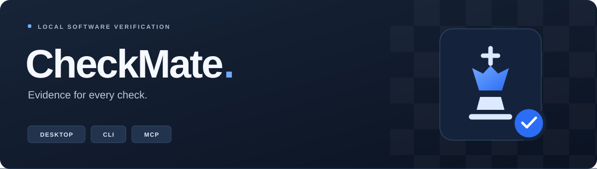
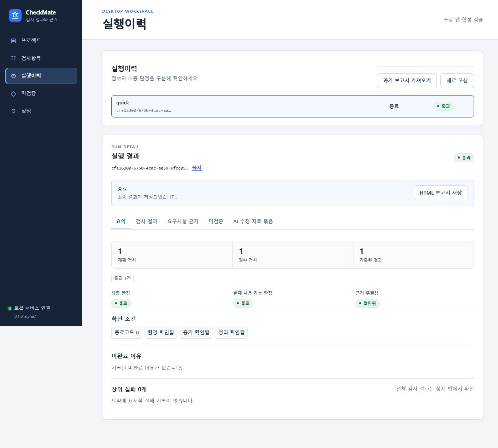

<p align="center">
  
</p>

<p align="center">
  <strong>AI가 만든 코드, 실행 결과와 증거로 확인하세요.</strong><br>
  사람과 AI 코딩 도구가 같은 검사와 결과를 공유하는 로컬 데스크톱 앱.
</p>

<p align="center">
  <a href="https://github.com/yeunlee1/checkmate/blob/develop/문서/개발현황.md"></a>
  <a href="https://github.com/yeunlee1/checkmate/blob/develop/문서/사용안내.md"></a>
  <a href="https://github.com/yeunlee1/checkmate/blob/develop/문서/저장및연결계약.md"></a>
</p>

<p align="center">
  <a href="#빠르게-시작하기">빠르게 시작하기</a> ·
  <a href="#체크메이트의-다섯-가지-특징">핵심 기능</a> ·
  <a href="#ai와-함께-사용하기">AI 연결</a> ·
  <a href="https://github.com/yeunlee1/checkmate/blob/develop/문서/사용안내.md">사용 안내</a> ·
  <a href="https://github.com/yeunlee1/checkmate/blob/develop/문서/개발현황.md">개발 현황</a>
</p>

---

## 개발부터 검증까지, 같은 흐름으로.

AI가 코드를 만들 때마다 사람이 화면을 누르고, 권한을 바꾸고, 저장된 값을 다시 확인하는 일은 빠르게 병목이 됩니다. 체크메이트는 프로젝트에 등록한 검사를 실행하고 **무엇을 확인했는지, 무엇이 실패했는지, 무엇이 아직 검증되지 않았는지**를 한곳에 모읍니다.

사람은 앱에서 계획을 확인하고 결과를 읽습니다. AI는 CLI 또는 MCP로 승인된 검사를 실행하고, 실패한 부분의 증거를 읽어 코드를 보완합니다. 기존 Playwright 검사와 백엔드 검사 명령을 프로젝트별로 연결해 사용합니다.

<p align="center">
  
  <br>
  <sub>실제 개발 앱에서 실행한 합성 프로젝트의 결과 화면.</sub>
</p>

## 체크메이트의 다섯 가지 특징.

| 기능 | 확인할 수 있는 것 |
| --- | --- |
| **요구사항 완료 근거** | 요구사항과 검사·코드 위치·증거를 연결하고, 검사 범위 밖이거나 근거가 빠진 항목을 구분합니다. |
| **AI 수정 자료 묶음** | 실패한 기대값과 관측값, 코드 위치, 증거 ID, 재검사 안내를 모아 AI에 전달합니다. |
| **역할별 정보 노출 검사** | 역할에 따라 보이면 안 되는 합성 표식이 화면과 API 응답에 노출되는지 확인합니다. |
| **검사의 검출력 측정** | Stryker로 코드를 변이시켜, 작성한 검사가 의도적인 오류를 잡아내는지 확인합니다. |
| **디자인 위반 위치 표시** | 브라우저에서 관측한 규칙 위반을 해당 실행의 스크린샷 좌표에 표시합니다. |

여기에 실행 이력, 미검증 항목의 보완 이력, HTML 보고서, 백업·복구, 실행별 일회용 PostgreSQL 관리를 제공합니다. 구체적인 검사 규칙과 기대값은 각 프로젝트에서 작성합니다.

## 검사 결과를 믿을 수 있도록.

- **확인한 계획으로 실행합니다.** 명령과 쓰기 범위를 확인하고 승인하며, 검사 원본이나 실제 소스가 바뀌면 새 계획을 확인합니다.
- **실제 종료와 증거를 확인합니다.** 프로세스 종료 상태, 소스·환경, 증거 파일의 해시, 정리 상태를 확인한 뒤 최종 판정을 저장합니다.
- **통과·실패·미완료·미확인을 구분합니다.** 필수 검사 누락이나 확인되지 않은 정리 상태를 통과로 처리하지 않습니다.
- **필요한 결과부터 읽습니다.** AI용 기본 요약은 UTF-8 8KiB 이내이며, 상세 결과는 구간별로 조회합니다. 제한된 증거는 본문을 반환하지 않습니다.

## 빠르게 시작하기.

현재는 **`0.1.0-alpha.1` 개발판**입니다. 아래는 Windows에서 소스로 실행하는 방법입니다. Node.js 24와 Git이 필요하며, 개발 코드는 `develop` 브랜치에 있습니다.

```powershell
git clone --branch develop https://github.com/yeunlee1/checkmate.git
cd checkmate
npm ci --ignore-scripts
node node_modules/electron/install.js
npx playwright install chromium
npm run build
npm run desktop:dev
```

앱을 실행한 뒤 다음 순서로 첫 검사를 진행합니다.

1. **로컬 저장소 준비**에서 검사 이력과 증거를 저장할 공간을 만듭니다.
2. **프로젝트 추가**에서 이 저장소의 `examples/대표검증` 폴더를 선택합니다.
3. **`normal` 프로필**의 계획에서 명령과 쓰기 범위를 읽고 승인합니다.
4. **검사 실행** 후 결과와 요구사항 근거를 확인합니다.

`defect` 프로필에는 저장·역할별 정보 노출·화면·접근성·계산 오류가 의도적으로 들어 있습니다. 이 프로필로 실패와 AI 수정 자료 묶음을 살펴볼 수 있습니다. 두 예제는 외부 계정이나 업무 DB 없이 실행됩니다.

> 일회용 PostgreSQL을 사용하는 프로필에만 Linux 컨테이너를 실행할 수 있는 로컬 Docker가 필요합니다. 자세한 설정은 [격리 시험 DB 안내](https://github.com/yeunlee1/checkmate/blob/develop/문서/격리시험DB.md)를 참고하세요.

## AI와 함께 사용하기.

체크메이트는 모델 API를 직접 호출하거나 API 키를 받지 않습니다. 사용 중인 Codex·Claude Code 같은 AI 코딩 도구가 자신의 구독과 실행 환경에서 **CLI 또는 stdio MCP**로 체크메이트를 호출합니다.

앱의 **설정 → MCP 실행 정보**를 AI 클라이언트에 추가하면 됩니다. stdio 연결이므로 공개 HTTP 서버를 별도로 운영할 필요가 없습니다. 사람용 앱과 AI용 도구는 같은 로컬 서비스와 검사 이력을 사용합니다.

```text
사람 ── 데스크톱 앱 / CLI ─┐
                          ├── 로컬 실행 서비스 ── 프로젝트 검사
AI   ── CLI / stdio MCP ───┘          │
                                SQLite + 증거 파일
```

AI에게 다음과 같이 지시할 수 있습니다.

> CheckMate로 승인된 검사를 실행해. 최종 결과와 증거를 확인해서 실패·미완료·미확인을 구분해 보고해. 문제가 있으면 수정 자료 묶음과 필요한 증거만 읽고 코드를 보완해. 검사와 기대값을 약화하지 말고, 바뀐 계획은 내가 확인할 수 있게 알려줘.

프로젝트 신뢰 등록과 계획 승인은 사람이 수행합니다. MCP는 이 승인 기능을 제공하지 않습니다. 자세한 명령과 결과 조회 방법은 [사용 안내](https://github.com/yeunlee1/checkmate/blob/develop/문서/사용안내.md)에 있습니다.

<details>
<summary><strong>CLI로 시작하기.</strong></summary>

빌드한 저장소 루트에서 실행합니다. `register`에는 신뢰하는 프로젝트 폴더를 지정합니다.

```powershell
npm run checkmate -- doctor
npm run checkmate -- setup --accept-local-storage
npm run checkmate -- register examples/대표검증 --trust
npm run checkmate -- projects --json
npm run checkmate -- --help
```

등록 후에는 `inspect`로 계획을 읽고 사람이 `approve`로 승인합니다. `run --wait`로 최종 판정을 기다리고 `result`에서 요약이나 `repair-bundle`을 조회합니다. 각 명령에 필요한 ID와 지문은 [CLI 사용 순서](https://github.com/yeunlee1/checkmate/blob/develop/문서/사용안내.md#cli와-mcp)를 참고하세요.

</details>

## 내 프로젝트에 연결하기.

프로젝트에 아래 세 파일을 두고, 실행할 명령과 검사 결과를 체크메이트의 계약에 맞춰 연결합니다.

```text
내 프로젝트/
└── checkmate/
    ├── 프로젝트.json    실행 환경과 프로필
    ├── 요구사항.json    확인해야 할 동작
    └── 검사항목.json    검사와 요구사항의 연결
```

[대표 예제](https://github.com/yeunlee1/checkmate/tree/develop/examples/대표검증)에서 정상·결함 프로필을 비교하고, [검사 작성 안내](https://github.com/yeunlee1/checkmate/blob/develop/문서/검사작성안내.md)에서 리포터와 증거 형식을 확인하세요. 프론트엔드 디자인, 접근성, 역할별 노출, 백엔드 로직의 검증 범위는 연결한 검사에 따라 정해집니다.

## 기술 구성과 개발 명령.

| 역할 | 기술 |
| --- | --- |
| 데스크톱 화면 | Electron · React · TypeScript · Vite |
| 검사 실행과 연결 | Node.js · CLI · stdio MCP |
| 이력과 증거 | SQLite · 로컬 파일 · SHA-256 |
| 브라우저와 접근성 | Playwright · axe |
| 회귀와 변이 검사 | Vitest · Stryker |
| 일회용 시험 DB | Docker · PostgreSQL |

```powershell
npm test                 # 빌드, 타입 검사, 회귀 검사
npm run desktop:test     # 실제 Electron 화면 흐름 검사
```

Windows 개발 설치와 실제 앱 흐름, Windows·Linux의 기반 빌드와 회귀 검사를 확인했습니다. 코드 서명, 깨끗한 Windows에서의 설치, 버전 간 업데이트 수용은 정식 출시 전에 남은 작업입니다. 현재 앱은 신뢰하는 프로젝트용이며 악성 프로젝트 코드를 격리하는 샌드박스를 제공하지 않습니다. 검증 근거와 자세한 지원 범위는 [개발 현황](https://github.com/yeunlee1/checkmate/blob/develop/문서/개발현황.md)에서 확인할 수 있습니다.

## 더 알아보기.

| 문서 | 내용 |
| --- | --- |
| [사용 안내](https://github.com/yeunlee1/checkmate/blob/develop/문서/사용안내.md) | 첫 실행, 결과 읽기, CLI·MCP, 백업과 복구 |
| [검사 작성 안내](https://github.com/yeunlee1/checkmate/blob/develop/문서/검사작성안내.md) | 프로젝트 등록 원본, 리포터, 증거 연결 |
| [검출력 사용법](https://github.com/yeunlee1/checkmate/blob/develop/문서/검출력사용법.md) | 실제 Stryker 실행과 변이 점수 해석 |
| [격리 시험 DB](https://github.com/yeunlee1/checkmate/blob/develop/문서/격리시험DB.md) | 일회용 PostgreSQL의 생성·실행·정리 |
| [구현 기준 설계](https://github.com/yeunlee1/checkmate/blob/develop/문서/구현기준설계.md) | 구조, 보안 경계, 실행과 판정 기준 |
| [개발 현황](https://github.com/yeunlee1/checkmate/blob/develop/문서/개발현황.md) | 구현 기능, 검증 근거, 남은 출시 조건 |
| [깃 관리](https://github.com/yeunlee1/checkmate/blob/develop/문서/깃관리.md) | 작업 브랜치와 검증·병합 규칙 |

---

<p align="center"><strong>CheckMate</strong> · 확인한 만큼, 근거와 함께.</p>
