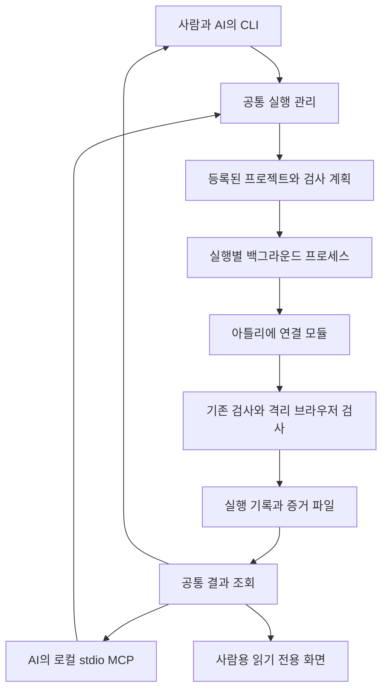

# E2E 검증 도구 개발 설계.

이 문서는 [요구사항 명세](요구사항명세.md)를 구현하기 위한 제안이다. 프로그램·설정 파일·MCP 도구 이름은 설계이며 아직 실행할 수 없다. 라이브러리 정확한 버전은 구현 시작 시 설치 환경과 공식 문서를 다시 확인해 잠근다.

## 1. 구조와 책임.

권장 기반은 Node.js와 TypeScript다. 기존 프로젝트의 Node·Vitest·Playwright 실행 도구를 연결하기 쉽고 CLI·MCP·조회 서버에서 같은 타입을 쓸 수 있다. UI는 먼저 단순한 로컬 웹 화면으로 만들며 독립 앱 설치 포장과 복잡한 프론트 프레임워크는 도입 필요가 생기면 검토한다.

검증 결과 저장은 실행별 JSON·NDJSON·파일을 사용한다. 첫 버전부터 별도 관리 DB나 클라우드 서버를 두지 않는다. MCP는 stdio이며 상시 HTTP 서버 없이 연결할 수 있다. 사람용 조회 서버는 필요할 때만 루프백에서 실행한다.

| 구성 | 책임 | 맡기지 않는 책임 |
|---|---|---|
| 공통 엔진 | 계획 검증, 실행번호, 동시 실행 제어, 상태, 종료/정리 증거. | 업무별 SQL·금액 계산 정답. |
| 프로젝트 연결 모듈 | 실행 명령, 환경 전제, 지원 검사, 결과 변환. | 원본 앱 전체 복사·임의 수정. |
| 대상 프로젝트 | 업무 기대값, fixture, 권한표, 서버 설정 주입. | E2E 프로그램 자체의 UI/저장/통신. |
| CLI/MCP | 입력 검증과 공통 엔진 호출, 결과 전달. | 각각 다른 성공 판정 로직. |
| 사람 화면 | 이력·검사·증거의 읽기 전용 표시. | 임의 셸 실행·DB 관리·기준 자동 승인. |

처음에는 한 패키지로 유지한다. 아래는 구현 시 필요한 경계이며 빈 폴더나 파일을 미리 생성하지 않는다.

- `src/핵심/`은 계약·계획·실행·판정·저장·증거를 담당한다.
- `src/연결/아틀리에/`는 현재 프로젝트 명령과 보고서 변환을 담당한다.
- `src/명령/`, `src/엠시피/`, `src/조회/`는 세 입구를 담당한다.
- `tests/`는 실행기·판정·보안 경계·입구별 동일 동작을 검증한다.

## 2. 실행 전 계획과 권한.

등록 설정은 `projectId`, 프로젝트 절대 경로, 허용된 명령 ID, 검사 프로필, 대상 엔진, fixture 종류, 준비 조건, 디자인 기준 ID, 보고서 위치를 담는다. 비밀 값은 담지 않고 필요할 때 로컬 비밀 공급 위치를 참조한다.

MCP는 명령 문자열·임의 실행 파일·SQL·임의 절대 경로를 받지 않는다. 신뢰한 프로젝트 등록과 프로필 ID만 입력받고, 내부에서 실행 파일과 인자 배열로 변환한다. 새 프로젝트 등록은 자동으로 명령 실행 권한을 부여하지 않는다.

실행 계획은 검사 목록·제외 이유·대상 DB/서버·쓰기 영향·소유 자원·정리 범위·설정 지문을 먼저 산출한다. 쓰기가 있다면 대상 테이블과 조건·예상 행 범위·마이그레이션 해시까지 제시한다. 사용자 확인 기록은 그 계획 지문에 결합하며 계획이 바뀌면 다시 확인한다. `approved: true` 같은 AI 입력값이나 대상 저장소의 과거 승인 문구만으로 승인하지 않는다.

확인 방법은 현재 사용자 대화 또는 사람이 조작하는 로컬 확인 절차다. 도구가 자체적으로 사람의 의사를 증명한다고 주장하지 않는다. 첫 구현에서는 실행 전 쓰기 계획을 반환하고 확인 근거가 없으면 `needs-approval`로 중단하는 단순한 계약부터 만든다.

## 3. CLI와 MCP 계약.

명령의 `e2e`와 MCP 이름은 제안이다. CLI는 사람이 읽는 기본 출력과 `--json`을 제공한다. MCP는 같은 결과 객체의 짧은 형태를 반환한다.

| 목적 | CLI 예시 | MCP 도구 | 주요 결과 |
|---|---|---|---|
| 등록 프로젝트 조회 | `e2e projects` | `list_projects` | ID·지원 프로필·연결 상태. |
| 사전 점검/계획 | `e2e inspect --project atelier-note --profile quick` | `inspect_project` | 준비 상태·검사 목록·쓰기 계획·차단 이유. |
| 실행 시작 | `e2e run --project atelier-note --profile quick` | `start_run` | `runId`, `status`, 조회 방법. |
| 진행 조회 | `e2e status 실행번호` | `get_run_status` | 단계·경과·종료 여부·다음 조회 권장 간격. |
| 결과 요약 | `e2e result 실행번호` | `get_run_result` | 범위·판정·실패·미실행·증거 ID. |
| 개별 검사 조회 | `e2e cases 실행번호` | `get_run_result`의 `section=cases` | 분류·상태 필터와 cursor 기반 검사 목록. |
| 개별 증거 | `e2e evidence 실행번호 증거번호` | `get_evidence` | 허용된 안전 필드, 제한된 내용과 다음 cursor. |
| 명시적 취소 | `e2e cancel 실행번호` | `cancel_run` | 요청 접수와 실제 종료 확인을 구분. |
| 이력 | `e2e history --project atelier-note` | `list_runs` | 페이지 단위 이력, 환경과 근거 수준. |
| 사람 화면 | `e2e view --project atelier-note` | 없음. | 로컬 읽기 전용 URL. |

`start_run` 입력은 `projectId`, `profile`, `requestId`, 선택적 `planId`다. 같은 요청 ID와 같은 계획은 같은 실행을 반환하며 내용이 다르면 충돌로 거절한다. `--wait`를 지정한 CLI만 완료까지 기다린다. 비동기 시작의 종료코드0은 접수 성공이지 검사 통과가 아니다. 대기 명령은 최종 검사 성공에서만0을 반환하고 실패/차단/불확실은 구분된 비영 코드로 문서화한다.

MCP 표준출력에는 프로토콜 메시지만 쓴다. 진행 로그는 표준오류 또는 실행 로그 파일에 남긴다. 브라우저 캡처·원본 로그는 요청하지 않은 응답에 붙이지 않는다. 기본 결과는 실패 상위5개와 약8KiB를 제안 상한으로 두고 나머지는 cursor로 조회한다. 이는 바이트 제한이며 토큰 수 보장이 아니다.

## 4. 장시간 실행과 자원 소유권.

CLI/MCP 접속 프로세스와 실제 실행 프로세스를 분리한다. 실행별 작업 프로세스가 파일 상태를 갱신하므로 MCP 연결이 끊겼다고 재실행하지 않는다. Windows에서 숨김 백그라운드 실행과 연결 해제 후 생존 여부를 실제 시험으로 확인한다. 이 조건이 충족되지 않으면 완료로 표시하지 않는다.

프로젝트의 정규화된 실제 경로를 기준으로 한 번에 하나의 쓰기 실행만 허용한다. CLI·MCP 양쪽이 같은 독점 잠금과 요청 ID 저장소를 사용한다. PID와 시작시각·runId·자원 소유 토큰을 기록하고 프로세스 이름이나 포트만으로 소유권을 추정하지 않는다.

취소·시간 초과는 자신이 만든 작업 프로세스와 하위 서버·컨테이너에만 적용한다. 종료 요청 접수와 실제 종료를 구분하고 유한한 대기 시간을 둔다. 프로세스 생존이 불명확하면 잠금을 자동 해제하거나 중복 실행하지 않고 `unverifiable`과 확인 절차를 표시한다. 다른 세션의3000/4000·DB·잠금은 건드리지 않는다.

기존 `tests/postgres/database.ts`는 함수 안에서 컨테이너 이름을 만들고 공통 purpose label만 붙인다. 이 fixture에도 실행 전 `runId`·소유 토큰을 전달하고 생성 자원을 내구성 있는 manifest에 등록한 뒤 자원 ID·종료 결과를 돌려주는 연결이 필요하다. 자식 Node의 종료가 Docker daemon의 컨테이너 종료를 뜻하지 않는다. 연동 전 실행은 정리 미확인을 `unverifiable/incomplete`로 남기며, 시작 전후 컨테이너 차집합이나 공통 label만으로 다른 세션의 자원을 추정해 종료하지 않는다. 이 제약은 신규 browser뿐 아니라 기존 postgres 프로필에도 적용한다.

첫 버전은 첫 실패 뒤 나머지 단계를 `not-run`으로 남긴다. 자동 재시도는 기본0회다. 추후 재시도를 도입하더라도 최초 실패와 재시도 결과를 모두 기록한다.

## 5. 아틀리에 연결과 검사 프로필.

| 프로필 | 연결 방법 | 전제/경계 |
|---|---|---|
| `history` | 기존 `.runtime/verification`의 보고서를 읽기 전용 변환. | 대상 자료 쓰기/재실행 없음. 새 도구의 변환 기록은 별도 보관. 원본 로그는 기본 공개하지 않음. |
| `quick` | 기존 `npm run verify:quick` 실행을 감싼다. | 최초는 단계 결과와 종료코드만 수집. 개별 검사 상세는 미기록. DB 쓰기는 없고 로그·임시 파일·캐시 쓰기는 있음. |
| `postgres` | 기존 `tests/postgres`를 구조화된 결과와 함께 실행. | Docker 준비·DB 쓰기 범위 확인과 기존 fixture의 run 소유권/정리 증거 연결 필요. |
| `browser` | PostgreSQL용 새 fixture와 독립 두 서비스를 사용하는 브라우저 검사. | 대상 프로젝트의 아래 연결 변경이 선행돼야 실행 가능. |
| `design` | 명시된 화면별 기준으로 스타일·배치·키보드·접근성·스크린샷 확인. | 기준 미확정 화면은 수용 판정 제외, 공백 표시. |
| `full` | 준비→정적/단위→격리 통합→빌드→실제 브라우저→해당 디자인 검사. | 기존 `npm run verify`를 그대로 별칭 처리하지 않음. 요구 검사 누락이면 전체 통과 불가. |

현재 일반 `playwright` 라이브러리와 직접 작성한 `.mjs` 스크립트를 사용한다. 모든 기존 테스트를 한 번에 Playwright Test로 교체하지 않는다. 기존 결과를 어댑터로 읽고 새 테스트는 구조화된 reporter 또는 명시적 evidence JSON을 제공한다. 단순 문자열 로그에서 기대값·개별 결과를 추정하지 않는다.

quick 최초 연결은 기존 단계 수준을 보존한다. 개별 시험의 목적·행동·기대·실제를 제공하려면 아틀리에 담당이 같은 quick 실행 안에서 Node/Vitest 구조화 reporter 또는 evidence 출력을 추가해야 한다. 새 E2E 연결 모듈은 그 계약을 읽는다. 다른 시각에 따로 실행한 시험 결과를 quick의 개별 결과로 붙이지 않는다. 구조화 출력에도 없는 값은 `unknown`이며 시험 제목에서 추론하지 않는다.

대상 프로젝트에서 필요한 최소 변경 제안은 다음과 같다. 이번 설계에서는 적용하지 않는다.

1. `src/lib/backend/transport.ts`의 고정4000 대신 테스트 전용 백엔드 주소를 안전하게 주입할 수 있도록 한다. 기본 개발 동작은 보존한다.
2. `package.json`의 프론트 개발 명령과 `scripts/start-frontend.mjs`의3000, `scripts/start-postgres-backend.mjs`의4000 및 실제 env-file 자동 로딩을 별도 시험 실행 경로 또는 명시적 설정 주입으로 분리한다. 기존 `npm start`·`npm run dev:backend:postgres`를 단순 포장하지 않는다. 시험 설정이 없으면 실제 비밀 파일이나 실자료 연결로 fallback하지 않고 중단한다. 일반 개발 기본값은 보존한다.
3. 테스트용 프론트 origin·Better Auth URL·trustedOrigins·인증/업무 Origin 검사를 같은 계획에 맞춘다. 프록시는 원래 Origin을 전달한다. 오류를 없애기 위한 Origin 치환이나 검사 완화는 하지 않는다. 쿠키 검사는 실제 가상계정 로그인 경로를 사용한다.
4. 새 E2E fixture와 기존 PG fixture가 실행별 PostgreSQL 컨테이너·자원 소유권과 인증·직원 상태·가상자료를 준비하고 자신의 자료만 정리하도록 한다. D1 fixture를 재사용하지 않는다.
5. 서버·DB의 readiness는 HTTP200뿐 아니라 엔진·runId와 테스트 연결 일치를 검증한다. 운영 공개 health에 비밀이나 내부 연결 정보를 노출하지 않는다.
6. E2E 스크립트가 base URL·증거 경로·fixture를 외부에서 받도록 최소 조정한다. 공용 `.runtime/e2e/failure.png` 덮어쓰기를 중단한다.
7. 독립 빌드/실행 경로를 사용해 개발 중 `.next`·백엔드 산출물과 충돌하지 않도록 한다. 현재 소스 스냅샷을 격리 작업 디렉터리로 준비하는 방식부터 검증한다. 비밀 설정·실자료·전체 저장소를 무차별 복사하지 않는다.

프론트/백엔드/DB 포트는 실행별 루프백 포트를 배정한다. 포트 검사와 시작 사이의 경합도 시작 실패로 처리하며 사용 중인 포트를 빼앗지 않는다. 허용한 가상환경 자격증명만 자식 프로세스에 전달하고 실자료 연결 환경변수를 그대로 상속하지 않는다.

브라우저도 실행별 비영속 컨텍스트를 만들고 가상계정만 사용한다. 실제 사용자의 브라우저 프로필·기존 storageState·현재 세션 쿠키를 재사용하지 않는다. 포트 격리만으로 인증 자료가 분리됐다고 판정하지 않는다.

## 6. 공통 결과 계약과 통과 조건.

실행 상태와 검사 판정을 분리한다.

- 실행 상태는 `queued`, `running`, `finished`, `blocked`, `cancelled`, `unverifiable`다. 완료 전 검증·보고서 저장·정리를 포함한 단계를 표시한다.
- 개별 판정은 `passed`, `failed`, `not-run`, `skipped`, `timed-out`, `interrupted`, `unknown`이다.
- 실행의 종합 판정은 `passed`, `failed`, `incomplete`, `unknown`이다. `source-changed`, `needs-approval`, `environment-mismatch`, `cleanup-failed` 등은 원인 코드로 기록한다.
- 과거 자료는 `origin=imported`, 종료 증거 없음은 `exitCode=null`, 당시 엔진 미상은 `databaseEngine=unknown`으로 보존한다. 원래 `passed`는 `reportedStatus`에 남기며 현재 검증 성공으로 승격하지 않는다.

공통 보고서는 `schemaVersion`, `runId`, 프로젝트·프로필·계획 해시, 시작/종료 시각, 실행 상태, 종합 판정, 부모/단계 종료코드, 변경 전후 소스 지문, 환경·DB 엔진·fixture·브라우저 버전, 기준 버전, 단계와 개별 검사, 실패/미실행 이유, 증거 목록, 정리 결과를 담는다.

개별 검사는 `requirementId`, `testId`, 목적, 사전 조건, 수행 행동, 기대 조건, 안전하게 표시한 실제 관측, 판정, 심각도, 소스 경로, 증거 ID, 시도 번호를 갖는다. 개별 검사 수를 알 수 없는 과거 자료에는 단계 수만 표시한다. 서로 중첩된 단위/API/브라우저 시험을 고유 업무 개수처럼 합산하지 않는다.

종합 `passed`는 다음을 모두 만족할 때만 저장한다.

1. 선택된 계획의 필수 검사가 실제 실행돼 통과했다.
2. 필요한 명령과 최종 작업이 정상 종료했고 종료코드0의 증거가 있다.
3. 소스·검사 계획·기준·설정이 실행 중 바뀌지 않았다.
4. 해당 자원을 사용하는 계획에서는 브라우저·API·DB·빌드가 같은 테스트 환경을 가리킨다. quick의 서버/DB처럼 원래 필요 없는 자원은 `not-applicable`로 기록하며 필수 검사 누락과 구분한다.
5. 필수 증거가 저장되고 최종 보고서가 정상 확정됐다.
6. 소유 자원의 종료/정리 결과가 확인됐다.

`quick` 통과는 quick 범위에만 적용한다. 최종 성공을 뜻하는 메시지는 보고서 확정 전에 출력하지 않는다. 현재 러너의 `checks-passed`는 중간 상태로 유지한다. 기존 Git 지문은 서버가 실제 로드한 빌드까지 증명하지 않으므로 신규 실행은 빌드 식별·환경 식별을 추가한다.

## 7. 저장·증거·사람 화면.

`.runtime/실행/<runId>/` 아래 실행 정보, 공통 결과, 이벤트, 안전한 증거, 제한된 원본 로그를 둔다. 원본 파일 경로를 API 입력으로 받지 않고 증거 ID를 내부 manifest에 대응시킨다. 결과 파일은 임시 파일 작성 뒤 교체해 부분 JSON을 읽지 않도록 한다. 읽는 동안 교체되거나 손상된 파일은 성공으로 복구해 꾸미지 않는다.

기존 보고서 수집은 원본 바이트 해시·원래 위치·수집시각을 함께 기록한다. 참조한 증거가 없거나 출처를 확인할 수 없으면 미확인이다. 과거 공용 캡처 폴더의 최근 파일을 특정 실행의 캡처로 연결하지 않는다.

신규 quick의 원본 보고서도 가장 최근 폴더를 추정해 연결하지 않는다. 실제 자식 실행이 반환한 경로·실행 식별자와 시작시각·소스 지문을 대조해 결합한다. 기존 러너의 `active.lock`과 새 도구 잠금이 충돌하면 차단하고 다른 잠금을 강제로 제거하지 않는다.

사람 화면은 실행 이력, 현재 환경, 검사 그룹, 기대/실제 값, 미실행 이유, 안전한 캡처를 보여준다. 로그가 없는 항목에 막연히 '모든 검사 통과'를 표시하지 않는다. 정적 내보내기는 UTF-8 단일 HTML로 하고 기본은 마스킹된 요약만 포함한다. 세부 캡처 포함 여부와 자료 성격을 확인한 후 내보낸다.

조회 서버는127.0.0.1에만 바인딩하고 Host/Origin을 검증한다. 읽기 전용 경로만 제공하며 실행·승인·기준 변경은 첫 화면에 넣지 않는다. HTTP 응답은 보안 헤더와 캐시 정책을 명시한다. JSON의 텍스트는 HTML로 실행하지 않는다. 경로 순회·인코딩 우회·심볼릭 링크/정션·루트 이탈·과대 파일을 검사한다.

보관 정책은 첫 버전에서 자동 삭제하지 않는 로컬 기록으로 시작한다. 디스크 사용량을 표시하고 정리는 명시적 로컬 조작으로 제한한다. 토큰 절약 지표는 요약/증거 반환 바이트·조회 횟수와 실제 모델 사용량을 별도로 기록한다.

## 8. 구현 순서와 검증.

| 단계 | 산출물 | 완료 증거 |
|---|---|---|
| 1. 계약과 과거 결과 | 공통 schema, 상태 판정, 아틀리에 보고서 importer, 가상 fixture. | 과거 passed/종료코드 없음/소스 변경/손상/모의 API 결과를 올바르게 구분. |
| 2. 공통 실행과 CLI | 계획·잠금·비동기 worker·취소·quick 단계 결과·종료 증거. | 실패 명령, timeout, 중복 요청, 작업 유실, 정리 실패 시험. 개별 상세 부재를 표시. |
| 3. MCP와 사람 화면·M0 | stdio 도구와 같은 조회 모델의 UI·단일 HTML. | 실제 MCP 클라이언트 호출, stdout 오염 없음, CLI 결과 동일, 데스크톱/모바일·키보드 확인. |
| 4. 기존 PG 검사 연결·M1 | fixture 소유권·정리 확인, 같은 실행에 귀속되는 구조화 출력. | PG 중단 뒤 컨테이너 정리 확인, 타 세션 자원 보존, 없는 기대/실제 값은 미기록. |
| 5. 격리 PostgreSQL E2E·M2 | 아틀리에 시험 전용 설정, 실행별 두 서버·DB·브라우저, 대표1흐름. | 실제 설정 자동 로딩/fallback 없음, 기존 서버·실자료 불변, 실제 브라우저 저장/조회·실패 증거. |
| 6. 업무·디자인·보안 확장 | 나머지 업무 흐름, 화면별 기준, 접근성·권한/입력 시험. | 의도적 권한/계산/화면 결함 발견, 비밀 값/경로/HTML 공격 시험. |

첫 시연 M0는 단계3까지이며 P0의 일부다. M1은 기존 PG 검사까지 기본 연결한 단계이고, M2는 대표1흐름으로 실제 브라우저 격리 연결을 증명한 단계다. 대표1흐름 통과를 업무 전체 회귀 완료라고 표시하지 않는다. 공통 엔진은 DB 없는 시험으로 먼저 개발할 수 있다. DB가 필요한 단계는 쓰기 영향과 현재 승인 범위를 확인한 뒤 진행한다.

## 9. 공식 문서 근거.

- [MCP 연결 규격](https://modelcontextprotocol.io/specification/2025-11-25/basic/transports)은 stdio의 자식 프로세스·표준 입출력과 stdout의 프로토콜 전용 사용을 정의한다. 정확한 지원 규격은 구현 시 SDK와 클라이언트의 협상 결과로 확인한다.
- [Playwright reporters](https://playwright.dev/docs/test-reporters)는 구조화된 결과를 제공한다. 기존 일반 라이브러리 스크립트에 자동 적용됐다고 가정하지 않는다.
- [Playwright webServer](https://playwright.dev/docs/test-webserver)는 테스트 대상 서버 준비를 다룬다. 우리 소유권·DB 확인 계약을 별도로 유지한다.
- [화면 비교](https://playwright.dev/docs/test-snapshots)와 [접근성 검사](https://playwright.dev/docs/accessibility-testing)를 기준으로 환경 고정·자동 검사 한계를 명시한다.
