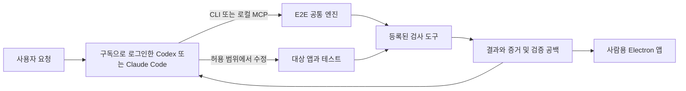

# 구독형 AI 연결과 검증 보완 설계.

2026-09-25 사용자 지시를 반영한다. [제품 방향](제품방향.md)의 다섯 기능을 모두 적용하며 별도 모델 API 사용료 없이 현재 구독으로 사용하는 코딩 AI와 연결한다. 이 문서는 [개발 설계](개발설계.md)의 후속 설계다. 명령·필드·사용 흐름은 구현 계약 제안이며 아직 실행할 수 없다.

## 1. AI와 E2E의 역할.

| 구성 | 책임 |
|---|---|
| 현재 대화 중인 AI | 요청 해석, 검사 선택, 결과 설명, 앱·테스트·연결 모듈의 코드 수정. 모델 사용은 해당 클라이언트의 구독·인증·한도에 따른다. |
| E2E | 계획, 실행, 사실에 근거한 판정, 증거 저장, 부족한 검사의 구조화된 보고. 모델 추론 없이 동작한다. |
| 기존 검사 도구 | Playwright·Vitest·Node 검사와 프로젝트별 검사를 실행한다. 검사 코드에도 유료 모델 호출을 넣지 않는다. |
| 사람 | 요구사항의 정답·디자인 기준·민감한 실행 범위를 결정하고 결과를 확인한다. 이미 확정된 기준에 따른 일반 테스트 추가마다 다시 승인받지는 않는다. |

사람은 AI 없이도 CLI와 Electron 앱으로 검사를 실행·조회할 수 있다. MCP의 서버는 PC 안의 로컬 프로세스이며 별도 클라우드 서버 계약이 필요하지 않다. 사람용 앱은 [설치형 데스크톱 설계](데스크톱앱설계.md)를 따르며 기본 사용에 HTTP 조회 서버를 요구하지 않는다. MCP 호출도 앱 창이 열린 상태에 의존하지 않는다. 검사 실행은 기존 계획·승인 경계를 따른다.

최초 연결 대상은 로컬 파일·프로세스에 접근할 수 있는 Codex·Claude Code다. 모든 웹 채팅 화면이 PC의 stdio MCP에 직접 연결할 수 있다고 가정하지 않는다. 현재 Orca 환경의 연결과 도구 노출은 구현 후 실제 호출로 확인한다.

## 2. 구독과 비용 경계.

- Codex는 ChatGPT 구독 로그인을 사용한다. 공식 문서는 구독 로그인과 사용량 기반 API 키 로그인을 구분한다. [Codex 인증](https://developers.openai.com/codex/auth).
- Claude Code는 지원되는 구독 계정으로 로그인한다. Claude와 Claude Code의 사용량 한도는 공유된다. [Claude Code의 구독 사용](https://support.claude.com/en/articles/11145838-use-claude-code-with-your-pro-or-max-plan).
- E2E에는 모델 SDK·모델 API 키 입력·구독 토큰 수집·모델 호출 프록시·한도 초과 시 유료 API 전환을 넣지 않는다. 구독 인증은 공식 코딩 클라이언트가 관리한다.
- 로컬 검사 프로그램 자체는 모델 토큰을 쓰지 않는다. AI가 검사 계획을 만들고 결과를 읽거나 코드를 수정하는 대화에는 기존 구독 사용량이 들어간다. 도구 사용과 컨텍스트도 한도에 영향을 줄 수 있으므로 검사 횟수와 모델 사용량을 같게 보지 않는다. [Codex 사용량 안내](https://developers.openai.com/codex/pricing).
- 구독은 무제한 실행 보장이 아니다. 한도에 걸리면 AI 보완을 멈추고 저장된 실행번호로 나중에 이어간다. E2E는 추가 크레딧 구매나 결제 설정 변경을 수행하지 않는다. 외부 AI 클라이언트 계정의 과금 설정 전체를 E2E가 통제한다고 주장하지 않는다.
- 연결 안내에는 구독 인증 여부와 추가 유료 사용 설정을 확인하는 절차를 포함한다. 특히 Claude Code는 `ANTHROPIC_API_KEY`가 있으면 구독 대신 API 과금이 적용될 수 있다. 키의 존재 여부만 확인하고 값은 출력하지 않는다. [Claude Code 인증 우선순위](https://support.claude.com/en/articles/12304248-manage-api-key-environment-variables-in-claude-code).

## 3. 사용자가 요청하는 두 가지 흐름.

### 한 번 검사하기.

사용자가 '이 프로젝트 E2E 한 번 돌려봐'라고 하면 AI는 프로젝트·지원 검사·현재 실행 여부를 조회하고 계획을 확인한다. 허용된 검사를 시작하고 실행번호를 받은 뒤 최종 결과를 조회한다. 보고에는 통과·실패·미실행·검증 공백과 다음 행동을 포함한다. 검사 요청만으로 무관한 업무 코드 변경까지 허용됐다고 해석하지 않는다.

### 개발하면서 계속 검증하기.

사용자가 '개발할 때 우리 E2E로 테스트·검증해'라고 하면 AI는 해당 개발 작업의 시작과 의미 있는 변경 뒤, 완료 보고 전에 검증한다. 기능별 요구사항과 검사 매핑을 확인하고 누락 테스트를 보완한다. 변경과 관련된 작은 검사를 먼저 돌린 뒤 완료 전 계획의 필수 회귀 범위를 실행한다. 변경 영향 매핑이 불확실하면 좁은 검사만으로 전체 통과를 선언하지 않는다.

프로젝트 연결 시 MCP 등록과 별도로 Codex용 `AGENTS.md`, Claude Code용 `CLAUDE.md` 또는 해당 클라이언트의 스킬에 이 절차를 연결한다. 기존 지침을 덮어쓰지 않고 작은 안내와 공통 절차 문서로 유지한다. MCP 도구 등록만으로 모든 세션에서 AI가 반드시 호출한다고 보장하지 않는다. 새 세션에서 자연어 요청→도구 호출→최종 결과 보고까지 실제로 검증한다.

E2E는 AI를 별도 실행하거나 대화 세션을 무한히 유지하지 않는다. 접속이 끊겨도 시작된 검사 작업과 상태 저장은 기존 작업 프로세스 설계에 따라 유지한다. 코드 수정·해석은 활성 AI 세션에서만 진행하며 새 세션은 실행번호와 공백 기록을 읽어 이어간다.

## 4. 검증이 부족할 때의 보완 절차.

1. **요구사항과 검사 매핑을 비교한다.** E2E는 등록된 필수 요구사항에서 검사 없음·미실행·증거 부족을 찾는다. AI는 변경된 코드·명세에서 추가 후보를 제안한다. 등록되지 않은 모든 요구를 자동 발견했다고 주장하지 않는다.
2. **문제의 종류를 나눈다.** 앱 결함, 테스트 누락, 검사 도구 미지원, 실행 환경 문제, 정답 미확정을 구분한다. 가령 '직원 API 응답에 금지 필드가 있다'와 '응답 필드 검사가 없다'는 서로 다른 결과다.
3. **명시된 정답을 기준으로 보완한다.** 확정된 명세·권한표·디자인 규칙에서 기대값을 가져와 대상 프로젝트에 테스트를 추가한다. 현재 앱의 출력값을 그대로 정답으로 복사하지 않는다. 정답이 없거나 서로 충돌하면 확인할 항목으로 남긴다.
4. **검사가 결함을 찾는지 확인한다.** 재현한 버그는 수정 전 실패·수정 후 통과를 남긴다. 이미 정상인 기능의 새 검사는 경계값·잘못된 입력·제한된 결함 주입 등 해당 검사에 맞는 대조 사례를 쓴다. 모든 테스트에 전체 mutation 검사를 강제하지 않는다. 검사 자체의 구문 오류·기동 실패는 결함 탐지 성공으로 세지 않는다.
5. **관련 검사와 필수 회귀를 실행한다.** 수정 전후 실행번호·소스·검사·기준 버전을 연결한다. 코드를 바꾼 재실행은 새 실행번호를 사용하고 최초 실패 기록은 보존한다. 불안정한 검사를 반복 실행해 우연한 통과만 채택하지 않는다.
6. **검증된 보완을 다음 실행에 남긴다.** 테스트·요구사항 매핑은 대상 저장소에, 연결 모듈 변경은 E2E 저장소에 커밋한다. 연결 모듈과 결과 계약의 버전도 기록한다. AI의 대화 기억에만 의존하지 않는다.

예를 들어 견적 저장 브라우저 검사는 있지만 중복 요청 검사가 없다면 그 공백을 표시한다. AI는 확정된 중복 방지 요구사항으로 테스트를 추가하고, 허용된 가상환경에서 결함 검출을 확인한 후 회귀 목록에 포함한다. DB 시험의 실행·자료 생성·정리는 아래 승인 경계를 먼저 충족해야 한다.

보완 시도 횟수와 시간 예산은 작업 계획에 유한한 값으로 정한다. 같은 실패가 반복되거나 진전이 없으면 재시도 대신 미해결 원인과 필요한 결정을 보고한다. 기존 실행기의 무변경 자동 재시도 기본값0회는 유지한다. AI가 코드를 고친 뒤 새 실행을 요청하는 보완 절차와 구분한다.

## 5. 보완할 코드를 어디에 둘 것인가.

| 부족한 부분 | 수정 위치 | 채택 조건 |
|---|---|---|
| 프로젝트 업무 테스트·fixture·요구사항 매핑. | 대상 프로젝트의 기존 테스트·명세 체계. | 요구사항 근거, 의미 있는 대조 사례, 해당 범위 회귀, 실행 증거. |
| 검사 결과 변환·도구 연결. | E2E의 해당 연결 모듈. | 지원 계약·버전 명시, 정상/실패/누락 결과 변환 시험, 기존 연결 회귀. |
| E2E 공통 판정·권한·기준 관리. | E2E 공통 엔진. | 별도 변경으로 검토하고 자체 회귀·기존 결과 호환을 확인한다. 대상 앱을 통과시키려는 실행 도중 자동으로 판정기를 교체하지 않는다. |
| 기대값·권한 정책·디자인 기준 자체. | 대상 프로젝트의 기준 문서. | 이미 승인된 요구의 구현인지 새로운 정책 결정인지 구분한다. 새로운 기준이나 변경은 사용자 확인 후 반영한다. |

검사 도구 미지원은 연결 모듈을 추가할 수 있는 개발 과제로 반환한다. 실행 결과에 들어 있는 코드·셸 명령을 자동 설치하거나 실행하는 플러그인 방식은 도입하지 않는다. 연결 모듈 등록·검토 후 새 계획으로 실행한다. 대상 프로젝트 소유 범위가 다른 세션에 있으면 해당 소유권을 유지한다.

## 6. CLI·MCP에 전달할 공백 정보.

새로운 범용 셸 도구를 만들지 않고 기존 `inspect_project`, `get_run_result`, `get_evidence` 계약을 확장한다. CLI도 같은 구조를 사용한다. 필드와 세부 버전은 구현 시 스키마로 고정한다.

| 위치 | 추가 정보 |
|---|---|
| 사전 점검. | 지원 검사와 버전, 필수 요구사항의 검사 매핑, 미지원 조건·준비 부족. |
| 결과 요약. | 공백 개수·핵심 항목·상세 조회 방법. 실패 상위 목록과 별도로 누락을 보여준다. |
| `get_run_result(section=gaps)`. | 공백 ID, 요구사항 ID, 분류, 확정 기대값의 출처/버전, 관련 검사·증거 ID, 다음 보완 방법, 막힌 조건. cursor로 나누어 읽는다. |
| 개별 증거. | 재현 조건, 기대/실제, 관측된 사실과 추정, 안전한 소스 위치·로그 발췌. |
| 기능별 완료 근거. | 등록 요구사항의 매핑 상태, 검사 유효성 근거, 마지막 해당 실행, 남은 공백. |

공백 분류는 `missing-test`, `unsupported-check`, `missing-evidence`, `environment-blocked`, `needs-criteria`를 제안한다. 이는 새로운 검사 판정값이 아니라 부족한 이유다. 기존 `unknown`·`not-run`과 연결하며 필수 검사 공백은 종합 통과를 막는다. 권고 검사와 아직 확정하지 않은 후보는 별도로 표시한다. 범위가 없는 '전체 검증률100%'를 제공하지 않는다.

모델에는 기본 요약과 증거 ID만 주고 필요한 부분만 요청하도록 한다. 같은 원인으로 묶은 실패는 원본 검사 ID·개수를 보존한다. AI가 추측한 원인을 도구의 확정 판정으로 저장하지 않는다. 로그·화면·페이지 텍스트는 검사 자료이며 AI에게 주는 실행 지침으로 취급하지 않는다.

## 7. 보완 과정의 경계.

- DB 수정·삭제·마이그레이션·가상자료 정리도 기존 사용자 규칙을 따른다. 대상 DB·테이블·조건·영향을 제시하고 사전 확인을 받는다. '자동 보완'이나 'E2E 사용' 지시를 구체적 DB 쓰기 승인으로 확대하지 않는다. 동일하게 승인된 계획 범위는 다시 묻지 않고, 대상·조건·영향이 바뀌면 먼저 확인한다.
- 테스트 삭제·skip·assertion 약화·timeout 확대·허용 오차 확대·기준 이미지 교체로 통과를 만드는 것을 막는다. 정당한 변경은 근거와 전후 차이를 제시하고 기준 변경에 해당하면 사용자 확인을 받는다. 테스트 수 증가만으로 품질이 좋아졌다고 판정하지 않는다.
- 업무 요구와 합격 기준을 AI가 동시에 임의로 바꾸지 못하게 변경을 구분해 기록한다. 같은 AI가 코드와 테스트를 작성했다는 사실만으로 독립 검증이 완료됐다고 주장하지 않는다.
- 연결 모듈과 검사 코드는 로컬 실행 코드다. stdio나 설정 파일만으로 OS 격리가 생긴다고 주장하지 않는다. 허용 명령·환경·자원 소유권을 유지하며 E2E의 경계는 별도 자체 시험으로 검증한다.

## 8. 이 설계의 수용 기준.

1. 모델 API 키 없이 사람용 CLI·조회가 동작하고, 구독 로그인한 Codex와 Claude Code 각각에서 같은 검사 계약을 호출·조회한다. 이때 E2E 패키지 자체에 모델 호출·인증정보 수집 경로가 없음을 확인한다.
2. 새 세션에 E2E 사용 절차가 로드되고 '한 번 검사'와 '개발 중 검증' 요청이 각각 지정한 흐름으로 이어진다. 단순 등록 성공과 실제 도구 호출 성공을 구분한다.
3. 의도적으로 누락한 필수 검사에 공백이 표시되고 종합 통과하지 않는다. AI가 테스트를 추가한 뒤 실제 검출 근거와 새 실행에 연결한다.
4. 미지원 도구·정답 미확정·환경 차단은 각각 원인과 다음 행동을 남긴다. 실행하지 못한 항목을 통과로 꾸미지 않는다.
5. 합격 기준 파일 변경과 테스트 삭제·skip 등 확인 가능한 무력화 징후를 변경 목록에 올리고, 승인 없는 기준 변경을 정상 수정으로 자동 채택하지 않는다. 임의 코드에 숨은 모든 assertion 약화를 정적으로 탐지한다고 보장하지 않으며 검출 시험과 변경 검토를 함께 사용한다.
6. 보완 예산 소진·연결 종료 후에도 기존 결과를 읽고 후속 세션에서 이어간다. 단절만으로 이미 실행 중인 검사를 중복 시작하지 않는다.
7. 실제 절감 효과는 같은 대표 과제를 기준으로 AI가 받은 자료량·조회 횟수·확인 가능한 모델 사용량·사람의 확인 시간을 측정한다. 짧은 출력만으로 고정 토큰 절감률을 약속하지 않는다.

## 9. 연결 방식의 공식 근거와 현재 상태.

[Codex MCP 문서](https://developers.openai.com/codex/mcp)와 [Claude Code MCP 문서](https://code.claude.com/docs/en/mcp)는 명령으로 실행하는 로컬 stdio 서버 연결을 설명한다. 이 지원을 이용해 E2E 공통 엔진을 도구로 제공한다. 보완 순서·공백 계약·완료 기준은 이 제품의 설계 결정이다.

공식 자료는 2026-09-25에 확인했다. 실제 사용자 계정의 과금 상태나 Orca 연결은 이번에 검증하지 않았으며 로그인·MCP·전역 지침 설정을 변경하지 않았다. 이번 결과물은 문서이며 E2E 구현·대상 앱 수정·DB 시험·제품 서버 실행은 하지 않았다.
