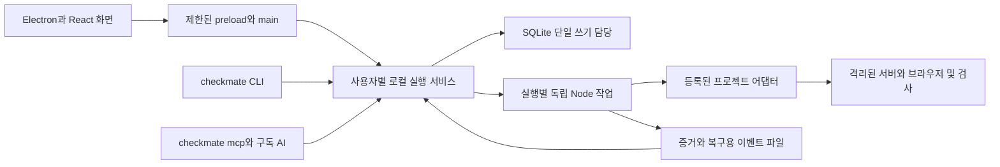

# 체크메이트 구현 기준 설계.

2026-09-25 확정한 첫 제품 설계다. 제품 이름은 CheckMate, 로컬 저장소는 사용자 후속 지시에 따라 `C:/dev/E2E`, 원격은 `yeunlee1/checkmate`로 유지한다. 이 문서와 [저장 및 연결 계약](저장및연결계약.md)이 현재 구현 기준이다. 이전 명세의 대상 프로젝트 조사 사실은 유지하되 파일 중심 저장·브라우저 조회 서버·단일 패키지 제안은 아래 결정으로 대체한다. 설계 확정과 구현·검증·출시 완료는 별개다.

## 1. 제품과 범위.

CheckMate는 개발자와 AI 코딩 도구가 기존 검사를 실행하고 결과·증거·미검증 항목을 함께 관리하는 설치형 데스크톱 앱이다. 독립 프로그램이므로 제품을 다른 앱의 확장 플러그인으로 소개하지 않는다. 공개 소개 문구는 다음과 같다.

> A desktop companion for developers and AI coding agents to run E2E tests, verify results, and track evidence.

첫 지원 환경은 Windows 11 x64다. 사람용 Electron 앱, CLI `checkmate`, 명령으로 시작하는 로컬 MCP를 함께 배포한다. 외부 Windows 네이티브 앱 자동화, 원격 협업 서버, 클라우드 동기화, 플러그인 마켓은 첫 제품 범위에 넣지 않는다. 첫 대상 프로젝트는 아틀리에 노트의 현재 구현 범위다.

다섯 기능은 모두 첫 제품의 목표 범위다. 요구사항별 완료 근거, AI 수정 자료 묶음, 역할별 정보 노출 검사, 테스트 검출력 검사, 디자인 위반 위치 표시를 순차 연결한다. 단계별 개발판이 다섯 기능을 모두 제공한다고 표시하지 않는다.

## 2. 확정 스택.

| 영역 | 선정 | 책임 |
|---|---|---|
| 설치 앱. | Electron. | 창·파일 선택·업데이트 안내·OS 연결. |
| 화면. | React + TypeScript + Vite, CSS 변수와 공통 컴포넌트. | 한국어 화면·표·증거 탐색·키보드 조작. 대형 UI 프레임워크는 처음부터 추가하지 않는다. |
| 실행 환경. | Node.js 24 LTS + TypeScript, npm workspaces. | Electron과 독립된 엔진·작업 프로세스. |
| 데이터. | SQLite + better-sqlite3. | 로컬 검사 목록과 실행 이력. ORM 없이 준비된 SQL과 버전별 마이그레이션을 사용한다. |
| 입출력 계약. | Zod. | 저장·CLI·MCP·프로세스 통신의 입력/출력 검증. |
| CLI. | Commander. | 사람이 읽는 출력과 JSON 출력. |
| MCP. | 공식 TypeScript MCP SDK, stdio. | 기존 구독 AI가 실행·결과·증거를 조회한다. |
| 검사. | Vitest, Playwright Test, axe-core, Stryker. | 자체 회귀, 브라우저, 접근성, 제한된 변이 검사. 기존 프로젝트 검사도 어댑터로 연결한다. |
| 배포. | Electron Forge + Squirrel.Windows. | 사용자별 Windows 설치본과 업데이트 산출물. |

선정 시 npm 메타데이터로 확인한 시작 후보는 Electron 44.4.5, React 19.3.0, Vite 8.3.1, TypeScript 7.0.2, Forge 7.11.2, better-sqlite3 13.0.3, MCP SDK 1.30.1, Commander 15.0.0, Zod 4.6.5, Playwright 1.63.0, Vitest 5.0.1, axe-core Playwright 4.13.0, Stryker 10.0.0이다. 이는 설치·상호 호환 검증 결과가 아니다. 각 패키지 도입 시 실제 설치되는 정확한 버전과 전이 의존성은 `package-lock.json`에 고정하고 같은 Windows 빌드에서 검증한다. 의존성을 한꺼번에 설치하기보다 해당 단계에서 사용하는 것부터 도입한다.

Vite는 화면 빌드에 사용하고 Forge는 완성된 자산을 포장한다. Forge의 Vite 플러그인은 공식 문서에서 실험적으로 분류하므로 기본 빌드 경로에 의존하지 않는다. Electron 메인과 preload는 별도 TypeScript 빌드다. SQLite 네이티브 모듈은 동봉한 일반 Node 프로세스에서만 로드하며 Electron 프로세스와 공유하지 않는다. [Forge Vite 플러그인](https://www.electronforge.io/config/plugins/vite), [Electron 네이티브 모듈](https://www.electronjs.org/docs/latest/tutorial/using-native-node-modules).

## 3. 코드와 실행 구조.

코드는 `packages/contracts`, `packages/engine`, `packages/desktop` 세 작업 공간으로 나눈다. 실제 소스 파일은 역할을 드러내는 한글 이름과 첫 줄 역할 주석을 쓴다. contracts는 런타임 검증·상태·판정, engine은 CLI/MCP·서비스·작업·어댑터·저장, desktop은 main/preload/renderer를 가진다. engine과 contracts는 Electron을 import하지 않는다. 별도 마이크로서비스나 웹 백엔드를 추가하지 않는다.

사용자별 실행 서비스 하나가 DB 쓰기와 실행 접수를 소유한다. 앱·CLI·MCP는 Windows named pipe로 연결한다. HTTP 공개 포트나 외부 서버는 필요 없다. 서비스가 없으면 동봉 Node로 숨김 실행하고 준비 확인 후 요청한다. 동시에 시작해도 같은 사용자 데이터 루트에는 서비스 하나만 연결되도록 독점 진입과 실제 접속 확인을 사용한다.

파이프 이름만 인증 수단으로 쓰지 않는다. 사용자 전용 ACL의 로컬 연결 정보와 비밀을 사용해 양쪽을 확인하고, 잘못된 버전·인증·과대 메시지를 거절한다. 같은 OS 사용자 권한으로 로컬 파일과 프로세스를 조작할 수 있는 공격자까지 완전히 격리한다고 주장하지 않는다. 서비스 중복·이름 선점·잘못된 인증은 자체 보안 시험 대상이다.

검사 실행은 별도 Node 작업이 담당한다. 실행 서비스는 worker 종료코드를 직접 관측한다. DB에는 서비스만 쓰고 worker는 이벤트와 증거 파일을 기록한다. 서비스가 죽으면 worker는 새 검사 단계를 시작하지 않고 자신이 소유한 자원 정리를 시도한다. 재접속 서비스는 복구 기록을 읽되 직접 관측하지 못한 종료를 성공으로 추정하지 않는다.

## 4. 사용자 화면.

화면은 프로젝트 선택 → 사전 점검과 실행 계획 → 진행 상태 → 결과와 증거 순서다. 첫 화면은 최근 프로젝트와 계속 실행 중인 검사, 마지막 결과를 보여준다. 왼쪽 메뉴는 프로젝트·검사항목·실행 이력·미검증·설정으로 고정한다.

| 화면 | 필요한 정보와 조작 |
|---|---|
| 프로젝트. | 경로·Git 상태·지원 프로필·도구 진단. 프로젝트 등록은 명령 실행 승인을 대신하지 않는다. |
| 검사항목. | 요구사항과 검사 연결, 활성/후보/보류 상태, 기준 버전과 변경 비교. 등록 원본을 변경하는 작업과 단순 조회를 분리한다. |
| 실행 계획. | 대상 환경·범위·예상 쓰기·소유 자원·빠진 준비·필요 확인. 사람이 여기서 구체적인 DB 영향 범위를 확인한다. |
| 진행. | 단계·경과·마지막 이벤트·취소 요청과 실제 종료 여부. 모르는 총 작업량을 임의 진행률로 표시하지 않는다. |
| 결과. | 선택한 범위의 판정·실패·미실행·근거 부족. 요구사항별 카드에서 기대/관측/증거로 이동한다. |
| 증거. | 캡처와 위반 위치, 안전한 로그, 실행 버전, AI 전달 묶음 복사와 HTML 내보내기. |
| 미검증. | 공백의 이유·담당 조치·연결된 보완 검사와 실행. 미검증을 숨기거나 자동 완료로 바꾸지 않는다. |
| 설정. | AI 연결 진단·데이터 위치·용량·백업·업데이트. 삭제·복구·마이그레이션은 대상과 영향을 먼저 표시한다. |

첫 테마는 밝은 중성 배경, 파란 주 동작, 성공/실패/미검증의 텍스트와 아이콘을 사용한다. 색만으로 상태를 구분하지 않는다. 글꼴은 Windows의 Segoe UI와 맑은 고딕, 기본 본문 14px 이상, 명시적 focus 표시와 논리적 Tab 순서를 사용한다. 화면 폭이 줄면 보조 패널을 접고 증거를 별도 보기로 제공한다. 1280×800, 1920×1080 및 Windows 배율 100/150/200%에서 핵심 동작을 확인한다. 대상 프로젝트의 디자인 기준과 CheckMate 자체 화면 기준은 별개다.

## 5. 검사 판정과 복구.

상태와 판정을 분리한다. 상태는 `queued/running/finished/blocked/cancelled/unverifiable`, 판정은 `passed/failed/incomplete/unknown`이다. 모든 필수 검사가 통과하고 종료코드0·소스 불변·환경 일치·필수 증거·자원 정리·결과 저장을 확인해야 최종 `passed`다. `checks-passed`는 중간 상태이며 출력 성공 문구로 승격하지 않는다.

실제로 관측한 검사 실패가 있으면 다른 미검증이 있어도 판정은 `failed`이며 누락 이유를 함께 남긴다. 실행 전 차단·사용자 취소·필수 미실행은 `incomplete`, 출처나 실행 생존·종료를 확인할 수 없으면 `unknown`이다. 과거 가져온 자료의 원래 상태는 `reportedStatus`로 보존하고 현재 실행 통과로 사용하지 않는다. 선택 프로필 밖의 검증을 통과했다고 보고하지 않는다.

같은 작업 경로에는 실행을 하나씩 접수한다. 첫 구현에서는 읽기 검사도 캐시·산출물 충돌을 피하려고 직렬 실행한다. 다른 프로젝트는 최대2개를 동시에 실행하고 자원 부족 시 큐에 둔다. 같은 `requestId`와 같은 계획은 같은 `runId`, 같은 ID와 다른 계획은 충돌이다. 단순 연결 끊김은 새 실행 요청이 아니다.

앱 창 닫기는 취소가 아니다. 서비스와 작업은 계속 실행되고 다음 접속이 같은 실행을 조회한다. 모든 클라이언트와 작업이 없으면 서비스는 60초 유휴 후 정상 종료한다. 취소는 정상 종료 요청 → 10초 대기 → 소유권이 확인된 작업만 강제 종료 → 정리 결과 확인 순서다. 확인 못한 프로세스·DB·컨테이너·잠금은 건드리지 않는다. PID만 쓰지 않고 프로세스 시작시각·runId·소유 토큰을 같이 확인한다. PC 종료 후 자동 재실행은 하지 않는다.

같은 코드의 자동 재시도는0회다. AI가 수정 후 새로 실행하는 보완은 부모 실행에 연결해 기본2회, 총15분을 한도로 제안한다. 이는 호스트 AI가 따르는 작업 지침이며 앱이 모델을 호출해 강제 수행하는 기능은 아니다. 실행 계획에 기존 시험의 더 긴 시간 한도가 있으면 그대로 표시하며 임의 단축하지 않는다. 예산이 끝나면 실패·미검증과 다음 행동을 반환한다.

## 6. 저장·권한·보안.

사용자 데이터는 `%LOCALAPPDATA%/CheckMateData`로 통일한다. 설치 수용 과정에서 Squirrel의 설치 폴더 `%LOCALAPPDATA%/CheckMate`와 충돌을 확인해 자료 위치를 분리했다. 명시적으로 선택한 이전 자료 경로는 자동 이동하거나 삭제하지 않는다. `state/checkmate.sqlite`, `runs/<runId>/`, `backups/`, `runtime/`, `bin/`을 나누고 실제 고객 자료·대상 앱의 비밀 파일은 복사하지 않는다. 검사·요구사항·기준의 원본은 프로젝트 Git 파일이며 SQLite는 버전별 목록과 실행 이력을 가진다. DB에서 원본 정의를 조용히 바꾸지 않는다. 상세 테이블·확정 순서는 [저장 및 연결 계약](저장및연결계약.md)을 따른다.

관리 SQLite와 대상 PostgreSQL의 권한을 분리한다. 최초 관리 DB 생성, 검사 기록에 필요한 갱신, 데이터 정리·스키마 변경도 대상·테이블·조건·영향을 제시해 사용자에게 먼저 확인받는다. 반복 기록은 사용자가 승인한 명확한 범위 안에서 수행하며 포괄적인 `approved: true` 값으로 권한을 만들지 않는다. 대상 앱의 DB 쓰기는 실행 계획의 지문과 연결한 별도 확인이 필요하다. 변경된 계획·테이블·조건·환경에는 이전 승인을 재사용하지 않는다. 이번 설계 작성과 초기 계약 개발은 DB 작업의 승인이 아니다.

MCP에는 임의 셸·SQL·경로 실행 기능을 노출하지 않는다. 등록된 프로필·허용된 실행 파일·인자 배열만 사용한다. 대상 코드와 테스트도 실행 권한을 가진 로컬 코드이므로 프로젝트 신뢰와 명령 변경을 점검한다. Electron 격리는 이 코드를 OS 샌드박스로 바꾸지 않는다.

Electron renderer의 Node 사용을 끄고 context isolation·sandbox·CSP를 적용한다. preload는 제한된 계약만 제공하며 main은 호출 프레임도 검사한다. 캡처·HTML·로그의 문장은 실행 지시가 아닌 비신뢰 데이터다. HTML 증거는 권한 있는 앱 화면으로 불러오지 않고 텍스트를 escape한다. 파일 ID를 실제 경로로 바꿀 때 정션·심볼릭 링크·상대 경로·크기·MIME을 검증한다. [Electron 보안 지침](https://www.electronjs.org/docs/latest/tutorial/security).

허용 환경변수만 자식에게 전달한다. 가상 계정과 합성 민감값으로 검사하며 auth 헤더·쿠키·토큰·비밀번호는 기본 저장과 응답에서 제외한다. 마스킹 전 원본은 기본 비활성이다. 스크린샷도 개인정보를 포함할 수 있으므로 안전한 시험 환경을 전제로 하며 외부 업로드는 자동으로 하지 않는다.

## 7. AI 연결과 보완.

Codex·Claude Code가 사용자 구독으로 실행되고 CheckMate는 그 AI가 호출하는 도구다. 제품에는 모델 API SDK·API 키 입력·구독 인증정보 추출·우회 프록시를 넣지 않는다. 검사 자체는 모델을 호출하지 않지만 AI가 결과를 해석하고 코드를 고치는 과정은 해당 구독의 사용량을 쓴다.

AI 연결 화면은 `checkmate mcp`를 실행하는 명령과 진단 기능을 제공한다. 기존 클라이언트 설정 파일 전체를 덮어쓰지 않는다. 도구 목록만 보이는 상태와 실제 계획→실행→결과 조회를 각각 확인한다. 설정 반영은 사용자가 선택한 클라이언트와 항목에 한정한다.

검증 공백은 `unsupported/missing-test/missing-baseline/missing-evidence/environment-blocked`로 분류한다. AI는 Git의 후보 검사·어댑터·매핑을 수정하고 CheckMate에 변경을 다시 읽히며 검출 근거를 붙인다. 테스트 코드 삭제·skip 증가·기대값/기준 이미지 변경은 차이에 표시한다. 활성 기준 변경과 공백의 수동 면제는 사람이 확인한다. 실제 검출 시험을 통과한 추가 검사는 새 버전으로 등록하고 이후 실행에서 재사용한다. 과거 결과를 덮어쓰지 않는다.

결과의 기본 응답은 UTF-8 JSON 기준8KiB, 실패 상위5건이다. 상세는 cursor로 읽는다. 근거 파일은 ID·종류·크기·해시만 먼저 보내고 요청 시 안전한 부분만 제공한다. 사실·추정·미기록을 구분하며 고정 토큰 절감률은 약속하지 않는다.

## 8. 아틀리에 연결 계약.

`history`는 과거 보고서 가져오기, `quick`은 기존 빠른 검사, `postgres`는 격리 PG 검사, `browser`는 실제 두 서버·PG·브라우저, `design`은 승인된 화면 기준, `full`은 계획에 필요한 프로필의 조합이다. 현재 D1 브라우저 스크립트나 모의 API 시험을 실제 PG E2E로 분류하지 않는다.

대상 프로젝트의 변경은 해당 프로젝트 작업으로 분리한다. 첫 연결은 history와 quick 단계 결과다. 이후 PG fixture가 생성 전에 runId·소유 토큰·의도한 자원을 기록하고 생성 후 컨테이너 ID, 최종 정리 결과를 반환해야 한다. 브라우저 연결은 시험 전용 설정·실제 env 자동 로딩 차단·실행별 포트·인증 Origin 일치·독립 빌드 경로가 선행 조건이다. 현재3000/4000 서버·실제 DB·기존 잠금은 재사용하거나 종료하지 않는다.

첫 실제 업무 흐름은 가상 직원의 로그인과 권한 확인 → 가상 고객 생성 → 견적 초안 저장 → API 및 화면 재조회다. 당시 구현된 범위에서 기대값을 담당 프로젝트 기준으로 고정한다. 주문·매출 등 미구현 기능은 완료 범위에 넣지 않는다. 기존 승인 없는 신규 DB 시험은 실행하지 않는다.

## 9. 설치와 업데이트.

Windows 사용자별 Squirrel 설치로 `CheckMate.exe`, 동봉 Node와 engine, CLI 연결 파일을 배포한다. 앱 ID는 `io.github.yeunlee1.checkmate`, 패키지 이름은 `checkmate`, Squirrel 내부 이름은 `CheckMate`로 정한다. Squirrel이 요구하는 AppUserModelID 형식은 패키지 설정과 함께 일치시킨다. 사용자에게 표시하는 이름은 CheckMate다. [Squirrel.Windows](https://www.electronforge.io/config/makers/squirrel.windows).

CLI는 사용자 데이터의 고정 `bin/checkmate.cmd`를 진입점으로 삼고 활성 설치 버전의 동봉 Node와 CLI를 실행한다. PATH 등록은 사용자가 선택하며 MCP 설정은 절대 경로를 제공해 PATH에 의존하지 않는다. Windows stdio 연결은 `cmd.exe /d /s /c`의 인자 경계를 정확히 처리한 명령으로 생성하고 공백·한글 경로에서 실제 확인한다. 구버전 실행기가 남아 있는 동안 설치 경로를 정리하지 않는다.

배포처는 현재 GitHub 저장소의 Releases다. 첫 버전은 수동 업데이트를 기본으로 한다. 앱에서 사용자가 업데이트 확인 → 릴리스 정보와 서명 검증 → 설치본 실행을 선택한다. 실행 중인 검사가 있으면 업데이트를 보류한다. 자동 백그라운드 설치·원격 설정 변경은 첫 버전에 넣지 않는다. `Setup.exe`, 패키지·체크섬·변경 설명·의존성 목록을 같은 릴리스에 묶는다.

공개 설치본은 Windows 코드 서명과 타임스탬프를 필수 릴리스 조건으로 둔다. 인증서 발급 주체·인증 수단은 실제 배포 전 필요한 외부 설정이다. 비밀 키는 저장소에 넣지 않는다. 서명 없는 개발 빌드는 개발판이라고 표시하고 공개 정식 설치본으로 취급하지 않는다. 업데이트 시 DB가 바뀌면 유휴 확인·사전 백업·사용자 확인·호환성 검사를 거친다. DB 버전보다 오래된 앱은 쓰기를 중단하고 복구 안내만 제공한다.

설치 제거는 기본적으로 검사 이력과 증거를 보존한다. 데이터 삭제는 별도 명시적 선택과 영향 확인을 요구한다. Node가 없는 깨끗한 Windows, 공백·한글 설치 경로, 재시작, 구버전→신버전 이력 보존, 실패한 업데이트 복구를 설치 수용 시험에 포함한다.

## 10. 구현 순서와 완료 조건.

| 단계 | 구현 범위 | 완료 조건 |
|---|---|---|
| 기반. | 공통 계약·판정·CLI 진단/보고서 검증·작업 실행 경계·테스트. | 실패·누락·비정상 종료를 통과로 바꾸지 않는 단위/프로세스 시험. DB 생성 없이 먼저 진행한다. |
| M0. | SQLite·로컬 서비스·history/quick·비동기 CLI/MCP·Electron 결과 화면. | 승인된 시험 DB에서 세 입구의 같은 결과, 중복·취소·재접속·손상 복구, 실제 구독 클라이언트 호출. |
| M1. | 아틀리에 PG 어댑터와 구조화 reporter·자원 소유권. | 같은 실행의 결과, 중단 후 본인 컨테이너 정리, 다른 세션 불변. |
| M2. | 격리된 실제 브라우저 업무1흐름·완료 근거·AI 전달 묶음. | 실제 로그인/저장/재조회·실패 증거·의도적 누락의 미검증 표시. |
| M3. | 역할별 정보 노출·디자인 위치·핵심 계산/권한 변이. | 미리 심은 노출·화면·계산 결함을 탐지하고 범위/동등 변이/timeout을 구분. |
| 출시. | Windows 설치·서명·수동 업데이트·내보내기·도움말. | 다섯 기능의 대표 수용 시험, 설치/업데이트/복구·접근성·비밀 자료 보호 시험 통과. |

개발판은 `0.1.0-alpha.N`, 다섯 기능의 대표 범위와 출시 조건을 충족한 첫 정식판은 `0.1.0`이다. 업무 전체·모든 보안 취약점·주관적 디자인 완성도를 보장한다는 뜻은 아니다.

성능 수용 시험의 기준은 Windows 11 x64, 4코어·RAM16GB·SSD, 실행1만건/개별 결과10만건으로 시작한다. 목록 첫 페이지와 상태 조회는 준비된 서비스에서 p95 500ms 이하, 기본 요약은8KiB 이하를 목표로 측정한다. 이 수치는 설계 목표이며 현재 측정 결과가 아니다. 큰 로그는 전체 메모리 적재 없이 제한된 구간만 읽는다.

현재 설계상 미선정인 핵심 기술은 없다. 실제 구현에서 검증할 항목은 네이티브 패키징, 프로세스 생명주기, 설치/서명, 성능, 대상 프로젝트 어댑터다. 외부 서명 자격·프로젝트별 업무 기대값·개별 DB 작업 승인은 해당 단계의 입력이며 제품 구조를 다시 선정해야 하는 미완성 설계로 남기지 않는다.
