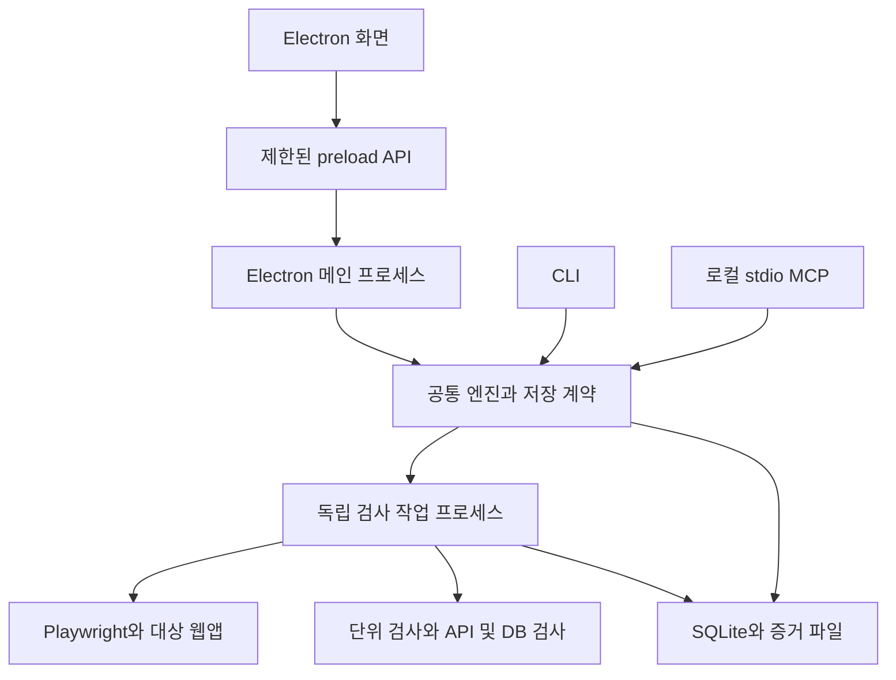

# 설치형 데스크톱 앱과 Playwright 적용 설계.

최신 상세 결정은 [구현 기준 설계](구현기준설계.md)와 [저장 및 연결 계약](저장및연결계약.md)을 따른다. 아래 문서는 제품 결정의 배경을 보존한다.

2026-09-25 사용자가 배포 편의성을 이유로 설치형 데스크톱 앱으로 진행하도록 지시했다. 앞서 제안한 Electron 앱과 독립 실행 엔진 구성을 반영한다. 이후 질문한 Playwright 적용 범위도 함께 정리한다. 이 문서는 [제품 방향](제품방향.md)의 후속 설계이며 앱·설치본 구현 완료를 뜻하지 않는다.

## 1. 바뀌는 사용 방식.

사람은 설치 후 아이콘으로 앱을 열어 프로젝트·검사·실행 결과·증거를 확인한다. 일반 사용에 터미널에서 서버를 켜거나 localhost 주소를 입력하는 절차를 요구하지 않는다. 화면은 패키지에 포함하고 Electron의 제한된 IPC로 엔진에 요청한다. 개발용 화면 서버와 대상 프로젝트의 테스트 서버는 사용자용 앱 실행과 구분한다.

AI는 같은 설치본에 포함된 CLI·stdio MCP를 사용한다. 앱 창이 없어도 실행·조회·취소할 수 있고, 나중에 앱을 열면 같은 실행번호의 결과를 본다. Node.js·TypeScript 공통 엔진, SQLite 관리 DB, 파일 증거, 기존 구독 AI 사용 방향은 유지한다.

현재 사용 환경인 Windows에서 설치본 검증을 먼저 진행한다. 다른 OS 지원은 해당 OS의 설치·실행·업데이트 확인 후 표시한다. 우리 도구의 설치형 제공을 외부 Windows 네이티브 앱 검사 기능의 추가로 해석하지 않는다.

## 2. 프로세스와 책임.

| 구성 | 책임 |
|---|---|
| Renderer. | 화면 표시·입력·진행 상태 표현. Node·SQL·셸을 직접 실행하지 않는다. |
| Preload와 main. | 필요한 기능만 연결하고 요청 출처·입력을 검증한다. 창·OS 대화상자·업데이트 안내를 담당한다. |
| 공통 엔진. | 계획·권한·중복 요청·실행번호·상태·판정·결과 조회. Electron을 import하지 않는 코드로 유지한다. |
| 독립 작업 프로세스. | 승인된 테스트 실행과 증거 수집·자원 정리. GUI나 MCP 연결 종료만으로 작업을 잃지 않는다. |
| 공통 저장 계층. | 사용자별 데이터 위치·SQLite·증거 참조를 일관되게 사용한다. 현재 상세 계약은 사용자별 서비스만 SQLite에 쓰고 파일/DB 확정 순서를 검증하도록 정했다. |

도식의 공통 엔진은 공유 코드와 계약이며 모든 입구가 하나의 프로세스라는 뜻은 아니다. CLI·MCP·앱에 중복된 성공 판정 로직을 만들지 않는다. 긴 검사와 대량 자료 처리를 화면이나 main의 이벤트 루프에서 실행하지 않는다.

Node 실행기와 CLI/MCP용 런타임을 함께 배포해 E2E 자체 실행에 별도 Node 설치를 요구하지 않는 것을 목표로 한다. 대상 프로젝트의 개발 도구·Docker·브라우저 준비는 따로 진단한다. 일반 Node 런타임을 별도 동봉하고 고정 CLI 진입점을 제공한다. Windows 종료·출력·취소는 설치본 수용 시험으로 확인한다. Electron 내부 Node와 일반 Node의 네이티브 모듈 ABI가 다를 수 있으므로 SQLite 드라이버를 두 환경에서 무조건 공유할 수 있다고 가정하지 않는다. [Electron 네이티브 모듈](https://www.electronjs.org/docs/latest/tutorial/using-native-node-modules).

## 3. 창 종료·재접속·데이터 위치.

- 창 닫기는 실행 중 검사의 취소와 구분한다. 검사 중 닫을 때 계속 실행되는 작업과 재확인 방법을 안내하고, 취소는 명시적인 동작으로 제공한다. 검사 작업은 창 종료 후에도 기록을 남겨야 한다.
- 앱 재실행과 MCP 재접속은 기존 실행번호를 조회한다. 프로세스 생존·소유권이 불확실하면 완료나 자동 재시작으로 바꾸지 않는다. PC 종료·프로세스 강제 종료까지 검사가 계속된다고 보장하지 않는다.
- GUI의 하위 프로세스를 만들었다는 사실만으로 독립 실행을 달성했다고 보지 않는다. 특히 Electron `utilityProcess`를 사용했다는 이유로 앱 종료 뒤 생존을 가정하지 않는다. 설치본에서 실제 생명주기를 확인한다.
- 설치 파일과 사용자 데이터를 분리한다. 앱·CLI·MCP가 같은 사용자 데이터 루트를 계산하도록 하며 현재 작업 폴더에 따라 서로 다른 관리 DB를 만들지 않는다. 사용자 자료를 읽기 전용 설치 디렉터리에 두지 않는다.
- 앱 업데이트나 제거가 검사 이력·기준·증거를 자동 삭제하지 않게 한다. 데이터 삭제·마이그레이션·정리는 대상과 영향에 대한 기존 사전 확인 규칙을 따른다.

## 4. Playwright를 적용하는 두 가지 위치.

| 검사 대상 | 적용 방식 | 범위와 제약 |
|---|---|---|
| 아틀리에 등 대상 웹앱. | 독립 Node 실행기에서 일반 Playwright 또는 대상 프로젝트의 기존 검사 명령을 실행한다. | Electron 화면과 분리된 브라우저 컨텍스트로 로그인·클릭·입력·응답·화면 증거를 검사한다. Electron 전용 실험 API에 의존하지 않는다. |
| 우리 Electron 앱 자체. | 개발 검증에서 Playwright의 `_electron.launch`, `firstWindow` 등으로 앱을 실행하고 화면을 검사한다. | 현재 공식 문서상 실험적 지원이다. 선택한 Electron·Playwright 버전 조합과 패키징 설정으로 호환성을 확인한다. |

Electron을 채택해도 기존 Playwright 사용 방향은 유지된다. 다만 Electron에 포함된 Chromium을 대상 웹앱 테스트 브라우저로 자동 재사용하지 않는다. Playwright 버전과 브라우저 바이너리 준비를 따로 관리하고, 사용자에게 필요한 다운로드·용량·실패 복구를 안내한다. [Playwright 라이브러리](https://playwright.dev/docs/library), [브라우저 설치와 버전](https://playwright.dev/docs/browsers).

우리 앱의 프로젝트 목록·검사 결과·실패 증거·키보드 이동·재접속 표시를 UI 회귀 대상으로 삼는다. 실제 DB를 수정하는 자체 시험도 테스트용 관리 DB의 대상·영향 확인 후 실행한다. 이미 열려 있는 사용자 앱과 실자료를 시험용으로 사용하지 않는다.

Playwright의 Electron 지원은 실험적이며 네이티브 파일 선택창을 직접 가로채지 않는다. 모의 대화상자로 앱의 선택 후 동작을 검사한 경우 OS 대화상자 자체를 검증했다고 표시하지 않는다. 설치·업데이트·OS 통합은 별도 시험으로 확인한다. 자동화 때문에 배포 앱의 격리·권한을 완화하지 않고, 시험용 설정과 실제 배포 설정의 차이를 기록한다. [Playwright Electron API](https://playwright.dev/docs/api/class-electron), [Electron 자동화 안내](https://www.electronjs.org/docs/latest/tutorial/automated-testing).

## 5. 앱 경계.

Renderer는 `nodeIntegration: false`, `contextIsolation: true`, sandbox와 CSP를 기본으로 설계한다. Preload는 정의된 기능만 노출하고 범용 `exec`, SQL, 파일 읽기, IPC 전체 객체를 전달하지 않는다. Main은 요청 스키마뿐 아니라 호출한 화면·프레임도 검증한다. 패키지 화면은 등록한 로컬 전용 프로토콜로 제한된 자산만 제공한다. [Electron 보안 지침](https://www.electronjs.org/docs/latest/tutorial/security).

검사 로그·캡처·HTML 증거는 신뢰할 수 없는 자료로 표시한다. 대상 웹페이지나 보고서 HTML을 앱의 권한 있는 화면으로 로드하지 않는다. 외부 링크·창 생성·탐색·경로는 명시한 범위만 허용한다. Electron 화면 격리가 검사 스크립트의 OS 샌드박스를 대신하지는 않는다. 기존 명령·프로젝트·자원 소유권·비밀 값 보호 규칙을 적용한다.

## 6. 설치와 업데이트.

첫 사용 흐름은 설치→앱 실행→프로젝트 선택→필수 도구 진단→검사 계획 확인→실행→결과 확인이다. CLI와 MCP는 같은 설치 버전에 포함하며 설치 위치에 공백·한글이 있어도 동작해야 한다. AI 연결 안내는 기존 클라이언트 설정을 보존하고 실제 도구 호출과 결과 조회로 성공을 확인한다. 최초 관리 DB 초기화와 이후 스키마 변경은 기존 DB 확인 규칙을 따른다.

패키징·설치·코드 서명·업데이트를 릴리스 작업에 포함한다. Electron Forge와 Squirrel.Windows, Windows 11 x64, 코드 서명, GitHub Releases 배포와 수동 업데이트를 선정했다. 버전과 배포 절차는 [구현 기준 설계](구현기준설계.md)를 따른다. 자동 업데이트는 Electron을 선택하면 저절로 완성되는 기능이 아니므로 배포 방식과 함께 정한다. [Electron Forge](https://www.electronforge.io/), [코드 서명](https://www.electronjs.org/docs/latest/tutorial/code-signing), [업데이트](https://www.electronjs.org/docs/latest/tutorial/updates).

업데이트 적용 전에 모든 입구에서 활성 작업·호환 버전·DB 스키마를 확인하고 새 실행과 업데이트가 경합하지 않게 하는 절차를 설계한다. 작업 중 실행 파일을 교체하거나 DB 마이그레이션을 적용하지 않는다. 업데이트 후에도 CLI/MCP의 진입 위치를 유지하고 앱·작업 프로세스·DB 버전이 맞지 않으면 원인과 복구 방법을 표시한다. 구버전이 새 스키마를 열 수 있다고 가정하지 않는다.

일반 검사는 로컬에서 수행한다. 설치본·브라우저·업데이트 다운로드에 필요한 통신과 모델 API 호출은 구분한다. E2E에는 모델 API 호출·추가 크레딧 구매를 넣지 않는다. 배포처 개설·인증서 구매·외부 게시·자동 설정 변경은 이번 설계 작업에서 실행하지 않는다.

## 7. 구현 전에 확인할 계약과 수용 기준.

- **남은 계약.** 화면 프레임워크·설치 도구·Node 실행기 포장, SQLite 드라이버와 데이터 루트, IPC/CLI/MCP 스키마, 업데이트 경합 제어, 실제 지원 버전·설치 형식을 구체화한다.
- **설치본.** 개발 체크아웃이 없는 Windows 환경에서 설치·실행·재실행·업데이트 후 이력 보존을 확인한다. E2E 자체 런타임과 대상 프로젝트 필수 도구를 구분한다.
- **입구 일치.** 앱·CLI·MCP에서 동일 실행의 판정·미검증·증거가 같고 중복 요청이 실행을 늘리지 않는지 확인한다.
- **독립 실행.** 앱 창이 없는 CLI/MCP 시작, 검사 중 창 종료, MCP 연결 종료, 앱 재실행에서 상태와 자원 소유권을 확인한다.
- **Playwright.** 대상 웹앱의 대표 흐름과 우리 Electron UI 검사를 구분해 실행한다. 개발본의 UI 검사 통과를 서명된 설치본·OS 동작의 통과로 확대하지 않는다.
- **실패 경로.** 브라우저 미설치·검사 실패·IPC 입력 오류·DB 잠금/중단·파일 누락·취소·업데이트 대기에서 거짓 성공 없이 복구 안내를 보여준다.

현재는 설계 반영과 공식 지원 범위 확인까지 진행했다. 패키지 설치·앱 구현·Playwright 실행·DB 작업·설치본 생성은 아직 수행하지 않았다.
