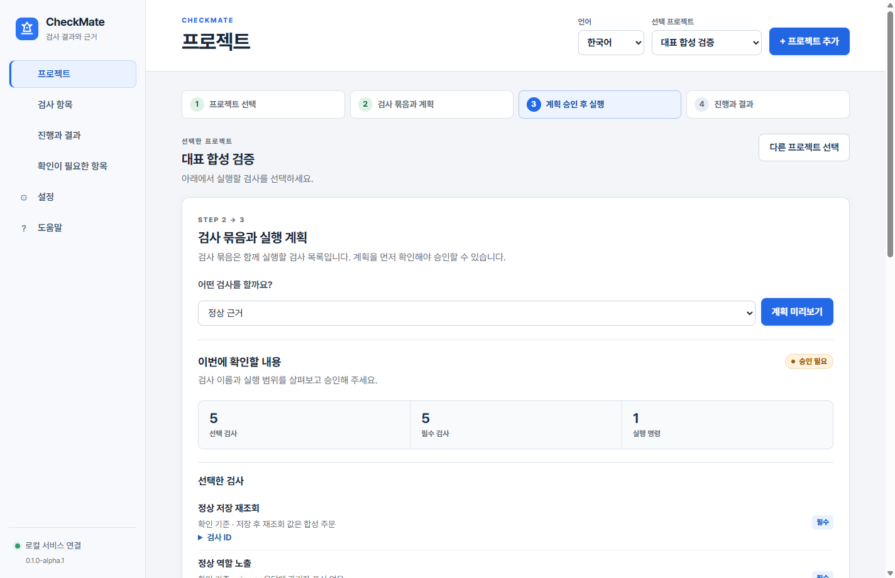
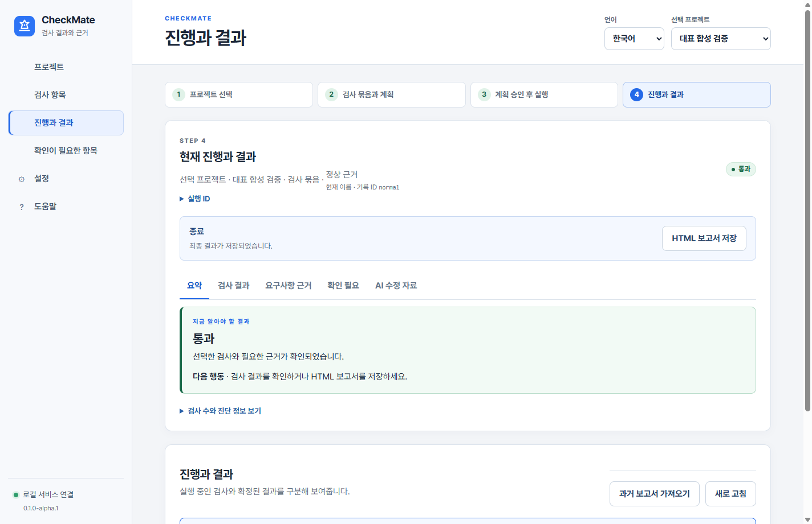
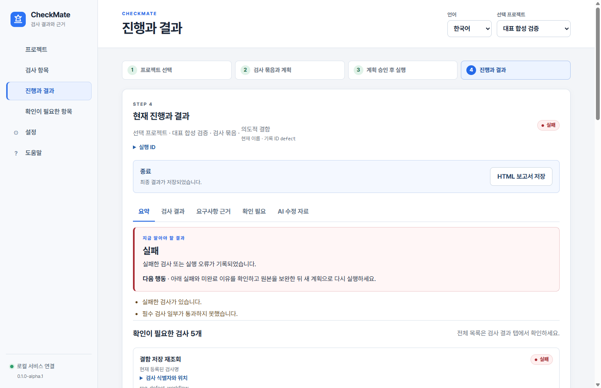
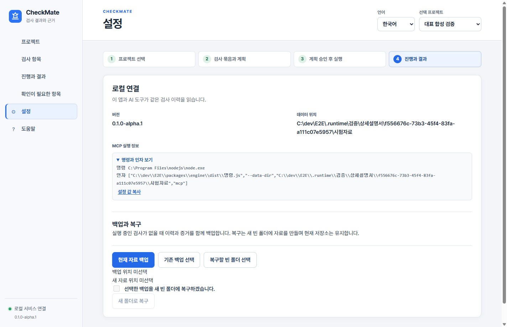

# 체크메이트 상세 사용 설명서.

CheckMate · `0.1.0-alpha.1` 개발판 · 2026-09-25 `develop` 구현 기준.

체크메이트는 **내 프로젝트의 검사를 실행하고, 결과와 증거를 사람과 AI가 함께 확인하는 프로그램**입니다. 사람이 검사할 범위를 확인하면 AI는 연결된 도구로 검사를 실행하고, 실패 원인을 읽어 코드를 보완할 수 있습니다.

이 설명서는 현재 구현된 기능을 다룹니다. 오래된 설치본은 메뉴가 다를 수 있습니다. 특히 한국어·영어 전환과 개선된 프로젝트 화면은 최신 개발 코드 기준입니다.

**처음에는 3~6장을 따라 대표 예제를 실행하세요. 실제 프로젝트 연결은 7장, Codex 연결은 13장, 매일 쓰는 요청 문장은 14장에서 시작하면 됩니다.**

## 찾아보기.

| 궁금한 내용 | 읽을 곳 |
| --- | --- |
| 이 프로그램이 정확히 무엇을 하나요? | [1. 역할과 검사 범위](#purpose) |
| 화면에 나오는 단어가 어렵습니다. | [2. 용어와 역할](#terms) |
| 어떻게 설치하고 실행하나요? | [3. 준비와 실행](#start) |
| 메뉴가 각각 무엇인가요? | [4. 화면 둘러보기](#screens) |
| 처음부터 한 번 따라 하고 싶습니다. | [5. 첫 정상 검사](#first-run) |
| 실패했을 때 무엇을 봐야 하나요? | [6. 실패 예제 따라 하기](#failure-tour) |
| 내가 개발하는 프로젝트를 추가하고 싶습니다. | [7. 실제 프로젝트 연결](#connect-project) |
| 보안·디자인·백엔드 검사는 어떻게 준비하나요? | [8. 검사 종류별 사용법](#check-types) |
| 검사를 추가하거나 코드를 바꾸면 어떻게 하나요? | [9. 변경과 재검사](#changes) |
| 진행률과 최종 결과를 어떻게 읽나요? | [10. 진행과 판정](#verdicts) |
| 증거와 확인 필요 항목은 무엇인가요? | [11. 근거와 보완 이력](#evidence) |
| 결과를 파일로 전달하고 싶습니다. | [12. 보고서와 과거 기록](#reports) |
| Codex·Claude Code와 어떻게 연결하나요? | [13. CLI와 MCP](#mcp) |
| AI에게 무슨 말을 하면 되나요? | [14. AI와 함께 쓰기](#ai-workflow) |
| 터미널에서 직접 실행하고 싶습니다. | [15. CLI 실전 사용법](#cli-reference) |
| 데이터는 어디에 저장되나요? | [16. 저장·백업·복구](#storage) |
| 시험 DB가 필요합니다. | [17. 일회용 PostgreSQL](#test-database) |
| 막히거나 오류가 났습니다. | [18. 문제 해결](#troubleshooting) |
| 매번 무엇을 확인하면 되나요? | [19. 작업별 확인표](#checklists) |
| 설명의 근거는 어디 있나요? | [20. 구현 근거](#references) |

<a id="purpose"></a>
## 1. 체크메이트의 역할과 검사 범위.

### 무엇을 해 주나요?

예를 들어 AI가 주문 저장 화면을 만들었다고 가정해 보겠습니다. 체크메이트에 다음 검사를 연결할 수 있습니다.

- 저장 버튼을 누른 뒤 화면을 다시 열어도 주문이 남아 있는지 확인합니다.
- 일반 직원의 화면과 API 응답에 관리자용 정보가 들어 있지 않은지 확인합니다.
- 작은 화면에서 저장 버튼이 화면 밖으로 나가지 않는지 확인합니다.
- 수량·단가·할인으로 계산한 합계가 맞는지 확인합니다.
- 실패한 검사의 실제 값, 관련 코드 위치, 캡처를 같은 실행 기록에 남깁니다.

체크메이트는 결과를 모아 통과·실패·미완료·미확인을 구분합니다. AI가 검사했다고 말하는 것과 실제 검사가 끝난 것을 구분할 수 있도록 실행 종료와 증거도 확인합니다.

### 무엇을 준비해야 하나요?

**프로젝트 등록만으로 모든 테스트가 자동 생성되지는 않습니다.** 현재는 프로젝트에 검사 정의와 실행 코드가 있어야 합니다. 없는 경우 AI에게 프로젝트를 분석해 검사 코드를 만들고 체크메이트 형식으로 연결하도록 요청합니다. 요청 예시는 [7장](#connect-project)에 있습니다.

검사 결과는 준비한 기준만큼 의미가 있습니다. 로그인만 검사했다면 주문 저장이나 전체 보안까지 확인한 것이 아닙니다. 연결하지 않은 기능은 별도로 남습니다.

### LLM이 프로그램 안에 들어 있나요?

체크메이트 자체는 LLM을 호출하지 않으며 모델 API 키를 요구하지 않습니다. 사용 중인 Codex나 Claude Code가 체크메이트를 도구로 호출합니다.

```text
사람이 검사 요청
  → AI가 체크메이트 도구 호출
  → 체크메이트가 실제 검사 실행
  → AI가 결과와 필요한 증거 확인
  → 코드 또는 검사 보완
  → 변경된 계획 확인 후 재검사
```

AI의 이용 조건과 사용량 제한은 사용하는 AI 클라이언트의 계정을 따릅니다. MCP로 연결했다고 모델 사용량이 무제한이 되는 것은 아닙니다.

<a id="terms"></a>
## 2. 어려운 용어를 먼저 풀어보기.

| 용어 | 쉬운 뜻 | 예 |
| --- | --- | --- |
| 프로젝트 | 검사하려는 프로그램의 폴더 | 주문 관리 웹앱 |
| 요구사항 | 프로그램이 반드시 해야 하는 동작 | 저장한 주문이 다시 보여야 함 |
| 검사 항목 | 요구사항을 확인하는 구체적인 시험 | 주문 저장 후 다시 조회 |
| 검사 묶음 | 이번에 함께 실행할 검사 목록 | 빠른 검사, 화면 검사 |
| 프로필, `profile` | 검사 묶음의 코드·CLI 이름 | `quick`, `normal` |
| 실행 명령 | 검사 코드를 실제로 시작하는 명령 | `tests/검사.mjs` 실행 |
| 실행 계획 | 실행할 검사·명령·환경·쓰기 범위 | 화면 검사 3개와 명령 1개 |
| 계획 지문 | 계획과 소스가 바뀌었는지 구분하는 값 | 승인할 때 확인하는 긴 문자열 |
| 실행 ID | 한 번의 검사 실행을 구분하는 번호 | AI에게 같은 실행을 조회시킬 때 사용 |
| 기대 | 맞다고 정한 동작이나 값 | 합계 650000원 |
| 관측 | 실제 실행에서 확인한 동작이나 값 | 합계 700000원 |
| 증거 | 결과를 뒷받침하는 파일이나 기록 | 캡처, 관측 JSON, 실행 로그 |
| 검사 원본 | 프로젝트에 저장하는 검사 정의 파일 | `checkmate/검사항목.json` |
| 활성 기준 | 현재 앱에서 사용하도록 채택한 검사 원본 | 변경 비교 후 사람이 활성화한 버전 |
| CLI | 터미널에서 명령으로 사용하는 입구 | PowerShell에서 검사 실행 |
| MCP | AI가 도구를 호출하는 연결 규약 | Codex에서 결과 조회 |

**명령 하나가 검사 다섯 개를 수행할 수 있습니다.** 진행 화면의 완료 명령 수를 통과한 검사 수로 읽지 마세요.

사람은 프로젝트를 신뢰할지, 검사 기준과 실행 범위를 승인할지 결정합니다. AI는 검사를 작성·실행하고 근거를 읽어 수정 작업을 돕습니다. 체크메이트는 실제 실행과 기록을 담당합니다.

<a id="start"></a>
## 3. 준비와 실행.

### 이미 앱이 설치되어 있다면.

1. 시작 메뉴나 설치된 `CheckMate` 앱을 엽니다.
2. 처음 실행하는 경우 **로컬 저장소 준비**를 진행합니다.
3. **설정 → 로컬 연결**에서 버전과 자료 경로를 확인합니다.
4. 최신 화면의 언어 선택이나 버튼이 없다면 설치본과 개발 코드의 차이를 확인합니다.

현재는 개발판입니다. 자동 업데이트를 제공하지 않습니다. 코드 서명과 깨끗한 Windows에서의 설치·업데이트 수용은 정식 출시 전 남은 작업입니다. 이 문서가 정식 설치본의 공개 배포를 의미하지는 않습니다.

### 소스 코드로 실행한다면.

Windows 기준으로 Node.js 24와 Git이 필요합니다. 아래는 저장소를 처음 내려받는 예입니다. 이미 저장소가 있으면 해당 폴더에서 의존성과 빌드 상태를 확인하세요.

```powershell
git clone --branch develop https://github.com/yeunlee1/checkmate.git
cd checkmate
npm ci --ignore-scripts
node node_modules/electron/install.js
npx playwright install chromium
npm run build
npm run desktop:dev
```

각 명령이 성공한 뒤 다음 명령을 진행합니다. `npm ci`는 기존 `node_modules`를 새로 구성하므로 실행 중인 개발 작업이 없는 상태에서 준비하세요.

| 준비 항목 | 필요한 경우 |
| --- | --- |
| Node.js 24 | 체크메이트 개발본과 CLI 실행 |
| Electron | 실제 데스크톱 앱 실행 |
| Playwright Chromium | 대표 예제와 해당 브라우저 검사 |
| 대상 프로젝트의 의존성과 빌드 | 그 프로젝트의 검사 코드가 요구할 때 |
| 로컬 Docker의 Linux 컨테이너 | `postgres-test` 자원을 사용하는 검사에만 필요 |
| Stryker·Vitest | 실제 변이 검사를 연결할 때 |

`http://127.0.0.1:5173/`은 개발 화면 미리보기입니다. 브라우저에서 URL만 열면 프로젝트 등록과 검사 실행에 필요한 데스크톱 연결이 없습니다. **실제 검사는 Electron 앱 창에서 진행합니다.** 로컬 실행 서비스는 앱·CLI 요청에 따라 시작되며 별도의 공개 백엔드 URL을 입력하지 않습니다.

### 로컬 저장소 준비는 무엇인가요?

체크메이트가 프로젝트 목록, 검사 이력, 근거 파일을 보관할 자기 전용 공간을 준비하는 단계입니다. 검사 대상 프로그램의 업무 DB를 초기화하는 버튼이 아닙니다. Windows 기본 자료 위치는 `%LOCALAPPDATA%/CheckMateData`입니다.

<a id="screens"></a>
## 4. 화면 둘러보기.

처음에는 왼쪽의 **프로젝트**, 검사를 시작한 뒤에는 **진행과 결과**를 주로 사용하면 됩니다.

| 한국어 메뉴 | 영어 메뉴 | 여기서 하는 일 |
| --- | --- | --- |
| 프로젝트 | Projects | 프로젝트 추가·선택, 검사 묶음 선택, 계획 승인과 실행 |
| 검사 항목 | Checks | 등록된 검사, 요구사항, 분류와 코드 위치 확인 |
| 진행과 결과 | Progress & results | 진행 중인 명령과 확정 결과, 이전 실행 조회 |
| 확인이 필요한 항목 | Needs review | 검사 누락·근거 부족과 보완 이력 확인 |
| 설정 | Settings | 버전·자료 경로·MCP 실행 정보 확인, 백업·복구 |
| 도움말 | Help | 기본 순서와 용어 확인 |

여러 프로젝트를 등록했다면 위쪽 선택기에서 대상을 확인하세요. 결과가 비어 있거나 예상한 검사와 다를 때 먼저 프로젝트 선택이 맞는지 봅니다.

### 언어 바꾸기.

화면 위쪽 언어 선택에서 **한국어 / English**를 고릅니다. 선택은 앱을 다시 열어도 유지됩니다. 메뉴·안내·파일 선택 창과 앱에서 새로 저장하는 HTML 보고서에 반영됩니다.

프로젝트 작성자가 넣은 검사 이름, 기대값, 관측 내용과 증거 원문은 자동 번역하지 않습니다. 영어로 전환했는데 검사 이름이 한국어로 남는 것은 정상입니다. CLI와 MCP의 데이터 키는 그대로입니다. 앱 글꼴은 포함된 Pretendard를 사용합니다.

### 접힌 항목은 언제 열면 되나요?

검사 ID·실행 ID·계획 지문·정확한 명령은 필요할 때 펼쳐 봅니다. 평소에는 검사 이름과 결과를 먼저 읽고, AI에게 특정 실행을 알려 주거나 문제를 분석할 때 ID를 사용하세요. 승인 전에는 명령·환경·쓰기 범위를 읽습니다.

<a id="first-run"></a>
## 5. 첫 정상 검사 따라 하기.

처음에는 실제 업무 프로젝트 대신 저장소의 **대표 합성 검증** 예제로 연습합니다. 예제가 만드는 서버와 자료만 사용하며 외부 계정이나 업무 DB는 필요하지 않습니다. [3장](#start)의 의존성과 Chromium 준비가 선행되어야 합니다.

### 1단계. 프로젝트를 추가합니다.

1. 왼쪽 **프로젝트**로 이동합니다.
2. **프로젝트 추가**를 누릅니다.
3. 저장소 안의 `examples/대표검증` 폴더를 선택합니다.
4. **대표 합성 검증**이 선택되고 검사 묶음을 고르는 화면이 나오는지 확인합니다.

선택할 것은 `대표검증` 폴더입니다. 그 아래 `checkmate` 폴더나 개별 JSON 파일을 선택하지 않습니다. 등록만으로 테스트가 실행되지는 않습니다.

### 2단계. 검사 묶음을 선택합니다.

**어떤 검사를 할까요?**에서 **정상 근거**를 선택하고 **계획 미리보기**를 누릅니다. 화면 이름은 정상 근거이며 CLI ID는 `normal`입니다.

| 검사 | 확인하는 내용 |
| --- | --- |
| 정상 저장 재조회 | 저장한 합성 값이 다시 조회되는지 |
| 정상 역할 노출 | viewer 응답에 관리자 전용 합성 표식이 없는지 |
| 정상 화면 위치 | 표시 요소가 400 × 300 화면 안에 있는지 |
| 정상 자동 접근성 | axe가 자동 확인한 접근성 위반이 있는지 |
| 정상 계산 비교 | 합성 계산 결과가 12인지 |

계산 비교는 합성 계산 결함 관측입니다. 이 예제만 실행해서 Stryker 변이 검사를 수행했다고 설명하지 않습니다.

### 3단계. 계획을 읽고 승인합니다.

계획에서 **선택 검사 5개, 필수 검사 5개, 실행 명령 1개**를 확인합니다. 이어서 다음 내용을 읽습니다.



그림 1. 검사 이름과 실행 범위를 확인하는 화면입니다. 승인과 실행 버튼은 계획 아래에 있습니다.

| 계획 항목 | 확인할 질문 |
| --- | --- |
| 선택한 검사 | 내가 확인하려는 기능이 들어 있는가? |
| 실행 명령과 환경 | 어떤 파일을 어떤 인자로 실행하는가? |
| 시간 제한 | 멈춘 검사를 언제 종료하는가? |
| 허용된 쓰기 경로 | 검사 중 어느 위치에 자료를 쓰는가? |
| 시험 자원 생성과 제거 | 임시 DB 같은 자원을 만드는가? |

확인 체크박스를 선택하고 **이 계획 승인**을 누릅니다. **승인은 실행 시작과 별개입니다.** 승인 뒤 **검사 실행**을 눌러야 검사가 시작됩니다.

쓰기 경로 표시는 승인 범위 안내입니다. 악성 코드를 OS 수준에서 막는 샌드박스를 뜻하지 않습니다. `writes: []`도 프로세스의 모든 파일 쓰기를 차단한다는 뜻이 아닙니다.

### 4단계. 진행을 확인합니다.

**현재 진행과 결과**에 선택 프로젝트와 검사 묶음이 표시됩니다. 현재 명령은 **정상 합성 앱 검사**입니다. 명령이 끝난 뒤에도 결과 확인과 자원 정리가 남을 수 있습니다.

최종 판정이 표시될 때까지 기다립니다. 접수됐거나 명령 수가 모두 찼다는 이유만으로 성공이라고 판단하지 않습니다.

### 5단계. 최종 결과를 읽습니다.

1. **요약**에서 통과 여부와 확인 조건을 봅니다.
2. **검사 결과**에서 다섯 검사의 기대와 관측을 봅니다.
3. **요구사항 근거**에서 이번 범위의 요구사항을 어떻게 확인했는지 봅니다.
4. 필요하면 **HTML 보고서 저장**으로 결과를 보관합니다.

정상 예제는 다섯 검사의 통과를 기대합니다. 실제 판정은 준비 상태와 이번 실행 결과를 따릅니다. 오류가 나면 [18장](#troubleshooting)을 확인하세요. 예제에는 결함 묶음의 별도 요구사항도 있으므로 정상 묶음 밖의 요구사항까지 완료로 바뀌지는 않습니다.



그림 2. 이 화면은 설명서 작성용 합성 예제의 실행 결과이며 사용자의 업무 프로젝트 결과가 아닙니다.

<a id="failure-tour"></a>
## 6. 실패 예제로 결과 읽는 법 익히기.

같은 프로젝트에서 **의도적 결함**을 선택합니다. CLI ID는 `defect`입니다. 새 계획을 미리 보고 승인한 뒤 실행합니다.

이 묶음에는 일부러 잘못 만든 저장값, 관리자 표식 노출, 화면 밖 요소, 이미지 대체 텍스트 누락과 계산 오류가 들어 있습니다. **이 연습에서 실패는 결함을 발견했다는 뜻입니다.** 체크메이트 프로그램 자체의 고장이라고 바로 판단하지 마세요.



그림 3. 의도적으로 만든 결함이 관측된 상태입니다. 기대와 관측을 비교한 뒤 증거를 엽니다.

| 표시 | 읽는 방법 |
| --- | --- |
| 검사 이름 | 어떤 동작에서 문제가 났는지 확인합니다. |
| 기대 | 맞아야 하는 값이나 동작을 확인합니다. |
| 관측 | 실제 결과가 기대와 어떻게 다른지 비교합니다. |
| 코드 위치 | 조사할 파일과 줄이 제공됐는지 확인합니다. |
| 증거 | 해당 실행의 캡처나 관측 파일을 엽니다. |

**검사 결과 → 결함 화면 위치**에서 화면 밖 요소의 근거를 살펴볼 수 있습니다. 공개 PNG 증거에서는 **캡처 보기**를 사용합니다. 연결된 디자인 JSON은 먼저 **안전한 텍스트 보기**를 누르고, 남은 구간이 있으면 **본문 더 보기**로 끝까지 읽습니다. 그다음 표시되는 **캡처에서 위반 위치 보기**를 누릅니다. 좌표를 확인하지 못했다면 위치를 추정해서 그리지 않습니다.

다음으로 **AI 수정 자료** 탭을 엽니다. 실패 내용, 누락, 코드 위치와 증거 ID를 읽는 곳입니다. 복사 결과가 일부 구간이면 더 보기와 전체 개수를 확인합니다.

이 예제의 기대값을 잘못된 값에 맞춰 바꾸거나 실패 검사를 삭제하지 마세요. 실제 프로젝트의 수정 흐름은 [9장](#changes)과 [14장](#ai-workflow)을 따릅니다.

**현재 대표 예제의 한계.** 역할 정보 노출과 화면 위치 검사는 브라우저 관측에 실패한 `unverified`도 `failed`로 기록하는 분기가 있습니다. 해당 검사에서 관측 내용이 `unverified`라면 실제 결함을 찾았다고 단정하지 말고 브라우저와 증거 수집 오류부터 확인하세요. 새 검사 코드에서는 관측 불가를 결과 계약의 `unknown`으로 전달해야 합니다. 이 설명서의 정상·결함 캡처는 관측이 완료된 실행입니다.

<a id="connect-project"></a>
## 7. 내가 개발하는 프로젝트 연결하기.

### 필요한 파일.

세 JSON 파일 모두 대상 프로젝트의 `checkmate` 폴더 안에 둡니다.

```text
내 프로젝트/
├── checkmate/
│   ├── 프로젝트.json
│   ├── 요구사항.json
│   └── 검사항목.json
└── tests/
    └── 검사.mjs
```

`tests/검사.mjs`는 실행 파일의 예이며 다른 안전한 프로젝트 상대경로도 사용할 수 있습니다. JSON 파일 이름은 현재 읽기 계약에 맞춰 위 이름을 사용합니다.

| 파일 | 기록하는 내용 |
| --- | --- |
| `프로젝트.json` | 프로젝트 ID·이름, 실행 명령과 검사 묶음 |
| `요구사항.json` | 확인해야 할 동작과 설명 |
| `검사항목.json` | 요구사항과 실행 명령 연결, 기대값·필수 여부·분류 |

프로젝트 ID는 UUID입니다. 서로 독립적으로 등록할 프로젝트에 예제 ID를 그대로 재사용하지 마세요. 명령·검사·요구사항·검사 묶음의 ID는 영어·숫자와 허용 기호로 작성하며 표시 이름은 한국어로 쓸 수 있습니다.

### AI에게 초기 연결을 맡기는 요청 예시.

> 이 프로젝트를 체크메이트에 연결해 줘. 기존 테스트와 실행 방법을 먼저 확인하고 checkmate/프로젝트.json, 요구사항.json, 검사항목.json을 준비해. 우선 로그인·권한·핵심 저장 후 재조회·주요 계산을 검사 묶음으로 나눠 줘. 없는 검사는 실행 가능한 코드로 추가하고 결과와 증거를 리포터로 남겨. 운영 DB와 실제 고객 자료를 사용하지 말고 합성 시험 환경을 준비해. 실행 명령, 쓰기 경로, 필요한 의존성, 아직 연결하지 못한 항목을 설명해 줘. 프로젝트 신뢰 등록과 계획 승인은 내가 할게.

이 문장은 작업 지시 예시입니다. 앱에 검사 정의를 자동 생성하는 버튼이 있다는 뜻은 아닙니다.

### 기존 테스트 연결하기.

현재 명령 계약은 Node의 `.js`, `.mjs`, `.cjs` 진입점을 사용합니다. `npm test` 문자열을 실행 파일 경로에 그대로 넣는 방식은 아닙니다. 기존 도구를 호출하는 Node 어댑터가 실행과 종료를 관리하고 결과를 전달하도록 연결합니다.

| 결과 방식 | 쓰임새 | 해석 범위 |
| --- | --- | --- |
| `exit-code` | 기존 명령의 종료 코드로 성공·실패 연결 | 개별 내부 테스트를 따로 관측한 것은 아님 |
| `ndjson` | 리포터로 개별 검사와 증거 전달 | 검사별 기대·관측·위치·증거 확인 가능 |

Vitest 시험 100개를 명령 하나의 종료 코드로 연결했다면, 체크메이트가 100개 각각을 판정했다고 보고하면 안 됩니다. 상세 추적에는 개별 결과를 읽는 어댑터가 필요합니다.

검사 ID·요구사항 ID는 원본과 실행 결과에서 같아야 합니다. NDJSON 표준 출력에는 일반 로그를 섞지 않도록 합니다. 상세 예제와 제한은 [검사 작성 안내](검사작성안내.md)를 참고하세요.

### 등록 전 확인할 것.

- 대상 프로젝트의 의존성과 필요한 사전 빌드가 준비돼 있습니다.
- 검사 코드가 필요한 브라우저·시험 서버·시험 계정을 준비합니다.
- 합성 자료를 사용하며 기존 업무 서버나 DB에 임의 연결하지 않습니다.
- 테스트가 만든 프로세스와 임시 자료의 정리 방법이 있습니다.
- 필수 검사와 이번 묶음에서 제외한 기능이 분명합니다.
- 계획을 만든 뒤 소스가 계속 바뀌지 않도록 실행 시점을 맞춥니다.

설치 앱이 대상 프로젝트의 의존성을 자동 설치하지는 않습니다. 현재 `@checkmate/engine`은 이 저장소의 비공개 워크스페이스 패키지이므로 공개 npm 패키지처럼 바로 다운로드할 수 있다고 가정하지 마세요. 다른 저장소에서는 사용할 로컬 패키지 배포·연결 경로부터 준비합니다.

<a id="check-types"></a>
## 8. 검사 종류별 사용법.

| 분류 | 현재 제공하는 방법 | 프로젝트에서 준비할 내용 |
| --- | --- | --- |
| 백엔드·업무 로직 `logic` | 테스트 명령 실행과 구조화 결과 수집 | 계산, 저장·재조회, 권한 거부, 경계값 시험 |
| 보안 `security` | 역할별 DOM·지정 API 응답의 합성 표식 노출 검사 | 역할별 실제 접근, 정보 정책과 응답 수집 |
| 디자인 `design` | 요소 존재·보임, 허용 CSS 값, 화면 안 배치 확인 | 대상 선택자, 화면 크기, 스타일 규칙 |
| 접근성 `accessibility` | axe 자동 검사와 위반 위치 수집 | 검사할 화면·상태와 브라우저 준비 |
| 검출력 `detection` | 실제 Stryker 결과 연결 | 변이 대상 코드, 설정과 실제 실행 |

### 디자인 검사.

‘예쁜가?’ 대신 **무엇을 지켜야 하는지**를 정합니다. 예를 들어 저장 버튼이 한 개이며 보이고, 배경색이 정한 값이며, 작은 화면 안에 있어야 한다는 규칙을 작성합니다. 스타일은 브라우저가 계산한 값을 비교합니다.

디자인 시안이나 Figma 파일을 자동으로 가져와 화면 전체와 비교하는 기능은 현재 없습니다. 규칙을 코드로 준비한 부분만 검사합니다. 위반 위치 표시는 실제 좌표와 같은 실행의 캡처가 연결된 경우에 사용합니다.

### 보안 검사.

합성 관리자 자료에 구분용 표식을 넣고 일반 직원으로 접속해 DOM과 관측한 API 응답에 표식이 나타나는지 확인할 수 있습니다. API를 검사 대상으로 선언했지만 응답을 수집하지 못했다면 통과 근거가 부족합니다.

내장 표식 검사는 모든 취약점을 찾는 보안 스캐너가 아닙니다. SQL 삽입, 세션 만료, 권한 우회, 속도 제한 등은 별도 테스트로 연결해야 합니다. 허용 표식의 관측 기록만으로 정상 접근 성공을 대신 판정하지 말고, 필요한 접근 성공·거부 조건을 테스트 코드에서 명시하세요.

### 백엔드 로직 검사.

정상 요청 외에 잘못된 입력, 권한 없는 요청, 중복 처리와 경계값을 정합니다. 저장 API의 성공 응답만 보지 말고, 필요한 경우 새 요청으로 다시 조회해 값이 남아 있는지 확인합니다. 이것은 작성할 기준의 예이며 프로젝트마다 자동 추가되는 검사가 아닙니다.

### 접근성 검사.

발견한 위반과 자동 판정이 어려운 항목을 구분합니다. 자동 위반이 없다는 결과만으로 키보드·읽기 순서·스크린리더 사용성 전체를 인증할 수는 없습니다. 사람이 확인할 부분은 요구사항과 별도 검사로 남깁니다.

### 검출력 검사.

`examples/검출력검증`의 `strong`과 `weak` 묶음으로 연습합니다. 같은 권한 함수에 작은 결함을 넣었을 때 기존 테스트가 잡는지 확인합니다. `Survived`는 결함이 남았는데 시험이 잡지 못했다는 뜻입니다. 시간 초과를 성공 검출로 바꾸지 않습니다. 준비와 실행은 [검출력 사용법](검출력사용법.md)을 따릅니다.

<a id="changes"></a>
## 9. 코드를 수정하거나 검사를 추가한 뒤 재검사하기.

### 프로그램 코드만 바뀐 경우.

1. 프로젝트에서 검사 묶음을 선택합니다.
2. **계획 미리보기**로 현재 소스 기준의 계획을 만듭니다.
3. 승인이 필요하면 변경된 범위를 확인하고 승인합니다.
4. **검사 실행**을 누릅니다.

오래된 계획이 거절되면 예전 지문을 강제로 재사용하지 않습니다. 새 계획으로 검사해야 변경된 소스에 대한 결과를 얻습니다.

### 검사 정의 세 파일이 바뀐 경우.

1. **프로젝트 정보와 검사 원본 관리**를 펼칩니다.
2. **원본 변경 확인**을 눌러 현재 파일과 활성 기준을 비교합니다.
3. 화면에 표시되는 검사 ID의 추가·제거·변경을 읽습니다. 요구사항과 명령의 변경 내용은 이 목록에 표시되지 않으므로 원본 JSON이나 Git 차이에서 따로 확인합니다.
4. 변경 확인 체크박스를 선택하고 **새 기준 활성화**를 누릅니다.
5. 검사 묶음을 다시 선택해 계획을 확인하고 승인한 뒤 실행합니다.

원본을 읽는 것과 활성 기준으로 채택하는 것은 별개입니다. 검사 파일이 바뀌었다고 AI가 스스로 승인하는 MCP 도구는 제공하지 않습니다.

### 새 검사 작성 기준.

‘보안 검사 추가’보다 ‘다른 매장의 고객 ID로 조회하면 응답에 고객 정보가 없어야 한다’처럼 관측 가능한 문장으로 작성합니다. 요구사항에 실행 코드·기대값·증거·필수 여부를 연결합니다.

잘못된 기대값을 수정할 필요가 있을 수 있습니다. 그때도 업무 기준이 왜 바뀌었는지 설명하고 검토합니다. 실패를 없애기 위해 기대값을 낮추거나 필수 검사를 선택 검사로 바꾸면 검증의 의미가 달라집니다.

<a id="verdicts"></a>
## 10. 진행 상태와 최종 판정 읽기.

### 진행 중에 볼 것.

프로젝트·검사 묶음·현재 명령·완료 명령 수를 확인합니다. 자원 준비, 명령 실행, 결과 확인, 자원 정리가 진행될 수 있습니다. 진행 정보를 읽지 못하면 추정한 진행률 대신 미확인 안내가 나옵니다.

창을 닫는 것은 검사 취소가 아닙니다. 실행 화면의 취소 버튼을 사용하고 실제 종료와 정리 상태를 확인하세요. 앱을 다시 열면 **진행과 결과**에서 실행을 조회할 수 있습니다.

### 실행 상태와 판정은 다릅니다.

| 실행 상태 | 뜻 |
| --- | --- |
| 대기 중 | 실행이 접수되어 기다리는 상태 |
| 실행 중 | 검사가 진행되는 상태 |
| 종료 | 실행이 끝난 상태. 성공 여부는 판정으로 확인 |
| 차단됨 | 실행 조건이 맞지 않아 진행하지 못함 |
| 취소됨 | 취소한 상태 |
| 확인 불가 | 중단 등의 이유로 실행을 확인할 수 없음 |

| 최종 판정 | 뜻 | 다음 행동 |
| --- | --- | --- |
| 통과 `passed` | 필수 검사와 종료·소스·환경·증거·정리 조건 확인 | 이번 범위 밖 요구사항 확인 |
| 실패 `failed` | 실패 관측 또는 작업 프로세스 실패 종료 | 기대·관측·근거를 읽고 수정 |
| 미완료 `incomplete` | 취소·차단·필수 검사 누락 등 완료 조건 부족 | 빠진 조건 보완 후 새 실행 |
| 미확인 `unknown` | 종료·환경·증거·정리 등 근거 확인 부족 | 표시된 이유와 자료 상태 확인 |

실패와 다른 부족 조건이 함께 있을 수 있으므로 색 하나만 보지 말고 이유 목록을 읽습니다. 개별 검사에는 미실행·건너뜀·시간 초과·중단도 표시될 수 있으며 필수 검사의 건너뜀을 통과로 세지 않습니다.

### 통과의 범위.

‘이번 소스와 실행 환경에서 선택한 검사 묶음의 기준을 만족했다’는 뜻입니다. 프로그램 전체의 기능과 보안을 확인했다는 뜻은 아닙니다. **요구사항 근거**에서 범위 밖 또는 일부만 검사한 요구사항을 확인하세요.

과거 판정과 현재 증거를 확인한 판정은 다를 수 있습니다. 예전에 통과했어도 증거가 바뀌거나 사라지면 현재 근거로 재사용할 수 없습니다.

<a id="evidence"></a>
## 11. 결과 탭, 증거와 보완 이력.

| 결과 탭 | 내용 |
| --- | --- |
| 요약 | 최종 판정, 대표 실패, 종료와 근거 조건 |
| 검사 결과 | 개별 기대·관측·상태·코드 위치·증거 |
| 요구사항 근거 | 연결된 검사, 범위 밖 검사와 빠진 근거 |
| 확인 필요 | 해당 실행의 검사 누락과 근거 부족 |
| AI 수정 자료 | 실패·누락·위치·증거 ID·재검사 안내 |
| 가져온 원래 기록 | 가져온 이력의 원래 보고 상태와 안전 요약 |

### 증거를 여는 순서.

1. 실패한 검사에서 증거 버튼을 선택합니다.
2. 파일 종류·크기·공개 범위·현재 무결성을 읽습니다.
3. 공개 텍스트는 **안전한 텍스트 보기**, 공개 PNG는 **캡처 보기**를 사용합니다.
4. 일부만 표시됐다면 **본문 더 보기**를 사용합니다.
5. 디자인 자료와 캡처가 연결돼 있다면 위반 위치를 확인합니다.

무결성 확인은 저장 당시 크기와 SHA-256을 현재 파일과 비교하는 것입니다. 내용이 사실이라는 업무 판단을 대신하지는 않지만 나중에 달라졌는지 확인합니다.

공개 HTML 증거도 활성 웹페이지로 실행하지 않고 텍스트로 표시합니다. 제한 증거는 앱과 MCP에서 본문을 반환하지 않습니다. 실제 계정 정보가 있는 증거를 읽기 위해 공개 범위만 임의로 바꾸지 마세요.

### 왼쪽 ‘확인이 필요한 항목’의 의미.

여러 실행에 걸쳐 필수 검사 누락과 근거 부족의 보완 상태를 추적합니다. 처음 발견한 실행, 보완한 실행, 현재 상태를 볼 수 있습니다.

같은 부족 항목을 매번 새 문제처럼 쌓지 않으며 관련 검사가 실제로 확인돼야 보완됨이 됩니다. 다른 묶음의 통과로 관련 없는 항목이 해결되지는 않습니다. 모든 코드 결함을 관리하는 일반 이슈 관리 도구는 아닙니다.

<a id="reports"></a>
## 12. 보고서 저장과 과거 기록 가져오기.

### 현재 실행의 HTML 보고서 저장.

확정된 실행을 열고 **HTML 보고서 저장**을 누릅니다. 새 파일 이름과 위치를 정하면 요약·요구사항·검사 결과를 담은 단일 HTML이 만들어집니다. 직접 열어 읽거나 브라우저에서 인쇄할 수 있습니다.

- 기존 파일을 덮어쓰지 않으므로 새 이름으로 저장합니다.
- 앱의 현재 언어가 새 보고서에 반영됩니다.
- 프로젝트 원문은 자동 번역되지 않습니다.
- 긴 관측은 축약될 수 있으며 원본 캡처와 로그는 자동 포함되지 않습니다.

전달 전에 프로젝트명·경로·관측 내용의 공개 범위를 확인합니다. 보고서는 이력과 증거 전체를 보존하는 백업과 용도가 다릅니다.

### 과거 보고서 가져오기.

**진행과 결과 → 과거 보고서 가져오기**는 현재 아틀리에 검증 JSON 형식을 대상으로 합니다. 모든 도구의 JSON이나 HTML을 변환하는 기능은 아닙니다.

안전한 단계 요약과 원본 해시를 저장하며 원본 로그와 비밀 값을 복사하지 않습니다. 원래 `passed`였어도 체크메이트가 실제 실행과 증거를 확인한 것이 아니므로 현재 판정은 **미확인**입니다. 같은 보고서를 다시 가져오면 기존 기록을 재사용합니다.

<a id="mcp"></a>
## 13. CLI와 MCP.

### 앱에서 연결 정보 확인.

**설정 → 로컬 연결 → MCP 실행 정보 → 명령과 인자 보기 → 설정 값 복사**를 사용합니다. 실행 프로그램 경로인 `command`와 전달할 목록인 `args`가 복사됩니다.

설치본은 동봉 Node와 설치된 엔진 경로를, 개발본은 개발 경로를 사용합니다. **자신이 사용할 앱이 보여 주는 값을 기준으로 등록하세요.** 자료 경로도 같아야 앱과 AI가 같은 프로젝트와 이력을 봅니다.

현재 앱에는 연결 정보 복사가 있습니다. ‘Codex에 연결’ 자동 등록 버튼이나 앱 안의 AI 채팅은 아직 없습니다.



그림 4. 이 캡처의 자료 경로는 설명서용 일회용 시험 경로입니다. 실제 연결은 자신의 앱에 표시되는 경로를 사용합니다.

### Codex 등록.

다음은 `C:/dev/E2E`에 빌드한 개발본이 있는 Windows 예입니다. 다른 위치라면 앱의 값으로 바꿉니다. 이미 등록했다면 먼저 기존 설정을 확인하고 필요할 때만 변경합니다.

```powershell
codex mcp add checkmate -- "C:/Program Files/nodejs/node.exe" "C:/dev/E2E/packages/engine/dist/명령.js" --data-dir "$env:LOCALAPPDATA/CheckMateData" mcp
codex mcp get checkmate
codex mcp list
```

새 Codex 세션의 `/mcp`에서 활성 연결을 확인합니다. `codex mcp list`는 저장된 설정 확인이며 실제 도구 연결은 별도로 확인해야 합니다. AI에게 ‘체크메이트의 사용 가능한 기능과 등록 프로젝트를 조회해 줘’라고 요청하면 검사 실행 없이 점검할 수 있습니다. [OpenAI 공식 MCP 안내](https://learn.chatgpt.com/docs/extend/mcp?surface=cli).

### Orca의 Codex 사용 시.

이 작업 환경에서는 Orca가 별도의 실행용 설정을 만들며 실행용 파일만 수정하면 항목이 사라지는 현상을 확인했습니다. 일반 Codex 원본 설정에도 등록한 뒤 실행 설정과 실제 도구 연결을 함께 확인해야 합니다. Orca 버전과 설치 방식에 따라 동작은 달라질 수 있습니다.

현재 셸의 설정 위치를 먼저 확인합니다. `CODEX_HOME`이 지정됐다면 기본 `.codex`와 다른 설정을 읽을 수 있습니다.

```powershell
$env:CODEX_HOME
codex mcp list
```

일반 사용자 설정 `%USERPROFILE%/.codex`에 등록해야 할 때만 다음처럼 경로를 지정하고 원래 환경으로 돌려놓습니다.

```powershell
$checkmatePreviousCodexHome = $env:CODEX_HOME
try {
    $env:CODEX_HOME = Join-Path $env:USERPROFILE '.codex'
    codex mcp add checkmate -- "C:/Program Files/nodejs/node.exe" "C:/dev/E2E/packages/engine/dist/명령.js" --data-dir "$env:LOCALAPPDATA/CheckMateData" mcp
    codex mcp get checkmate
} finally {
    $env:CODEX_HOME = $checkmatePreviousCodexHome
}
```

이후 Orca의 새 Codex 세션에서 확인합니다. 실행 설정을 계속 덮어쓰거나 다른 MCP 설정을 통째로 교체하지 않습니다. 기존 연결이 정상이라면 등록을 반복할 필요는 없습니다.

### Claude Code 등록.

Claude Code도 같은 정보로 stdio MCP를 등록합니다. 아래는 사용자 범위에 등록하는 개발본 예입니다. Claude Code가 설치돼 있어야 합니다. 이 문서 작성 시 로컬 Claude 연결을 실제 실행한 것은 아닙니다.

```powershell
claude mcp add --transport stdio --scope user checkmate -- "C:/Program Files/nodejs/node.exe" "C:/dev/E2E/packages/engine/dist/명령.js" --data-dir "$env:LOCALAPPDATA/CheckMateData" mcp
claude mcp list
```

Claude Code의 `/mcp`에서 연결을 확인합니다. 등록 명령과 범위는 [Claude Code 공식 MCP 안내](https://code.claude.com/docs/en/mcp)를 기준으로 합니다.

### 서버를 직접 켜 두어야 하나요?

stdio는 AI 클라이언트가 등록한 명령을 실행해 로컬 프로세스와 통신하는 방식입니다. 공개 HTTP 서버나 URL이 필요하지 않습니다. 터미널에서 `mcp`만 직접 실행하면 프로토콜 입력을 기다릴 수 있으므로 정상 사용은 AI 클라이언트에 등록해서 호출하는 것입니다.

### AI가 사용할 수 있는 도구.

| 도구 | 용도 |
| --- | --- |
| `get_capabilities` | 기능과 준비 상태 조회 |
| `list_projects` | 등록 프로젝트 조회 |
| `list_checks` | 검사 목록 조회 |
| `inspect_project` | 현재 계획과 필요한 승인 확인 |
| `start_run` | 승인된 계획 실행 접수 |
| `get_run_status` | 상태와 최종 확정 여부 조회 |
| `get_run_result` | 요약·검사·요구사항·누락·수정 자료 조회 |
| `get_evidence` | 증거 메타데이터와 허용 본문 조회 |
| `cancel_run` | 취소 요청 |
| `list_run_resources` | 해당 실행의 시험 자원 조회 |
| `list_runs` | 실행 이력 조회 |
| `list_gaps` | 미검증 항목과 보완 상태 조회 |
| `sync_catalog` | 원본과 활성 기준의 변경 비교 |

프로젝트 신뢰 등록, 계획 승인, 검사 기준 활성화, 수동 DB 정리·정리 확인은 사람용 앱이나 CLI의 작업입니다. MCP에는 이를 스스로 승인하는 도구가 없습니다. AI가 사람용 CLI로 우회해 승인하도록 지시하지 마세요.

<a id="ai-workflow"></a>
## 14. AI와 함께 쓰는 요청 문장.

### 연결 확인.

> 체크메이트에 연결해서 사용 가능한 기능과 등록 프로젝트를 조회해 줘. 아직 검사를 실행하지 말고 어떤 프로젝트와 검사 묶음을 사용할 수 있는지 알려줘.

### 방금 만든 기능 검사.

> 방금 수정한 기능을 체크메이트로 검사해 줘. 프로젝트와 검사 묶음을 먼저 확인하고 현재 소스의 계획을 보여 줘. 승인이 필요하면 내가 앱에서 확인할 수 있게 알려줘. 최종 결과가 확정되면 통과·실패·미완료·미확인과 이번에 검사하지 않은 기능을 구분해 보고해 줘.

### 수정과 재검사 반복.

> 이 작업은 체크메이트로 검증하면서 진행해 줘. 승인된 검사를 실행하고 실패하면 수정 자료와 필요한 증거만 읽어 원인을 고쳐. 수정 후 새 계획을 확인하고 필요한 승인을 요청해. 테스트 삭제, 필수 검사 해제, 기대값 완화로 통과시키지 마. 같은 소스를 이유 없이 반복 실행하지 말고 실패 원인과 수정 내용을 기록해 줘.

### 검사 방법이 없는 기능 발견.

> 이번 변경에서 아직 검증할 수 없는 항목을 찾아줘. 검사 코드 없음, 시험 환경 없음, 증거 부족, 사람 판단 필요로 나눠 설명해. 자동 검사로 만들 수 있는 부분은 테스트와 요구사항 연결을 추가하고 바뀐 기준과 실행 범위를 내가 검토하게 해 줘.

### 토큰 사용 줄이기.

> 먼저 결과 요약만 읽어. 문제가 있으면 AI 수정 자료와 관련 검사·증거 구간만 조회해. 전체 로그를 반복해서 붙이지 말고 실행 ID와 핵심 근거를 포함해 보고해 줘. 결과가 잘렸다면 생략 개수와 다음 구간을 확인해.

기본 응답은 크기를 제한하고 상세는 구간별로 읽습니다. 기본 요약 한도 8KiB는 바이트 한도이며 토큰 수 보장은 아닙니다. 증거 본문 요청에는 별도의 더 큰 응답 한도가 적용됩니다.

### 최종 보고에서 확인할 것.

| 항목 | 필요한 이유 |
| --- | --- |
| 프로젝트와 검사 묶음 | 다른 프로젝트 결과와 혼동 방지 |
| 실행 ID와 최종 확정 여부 | 실제 실행 재조회 |
| 현재 판정 | 과거 통과와 현재 근거 구분 |
| 실패 검사와 기대·관측 | 수정할 내용 파악 |
| 증거 ID와 코드 위치 | 근거 다시 열기 |
| 미실행·미확인·범위 밖 항목 | 빠진 검증을 성공으로 오해하지 않기 |
| 다음 행동 | 재승인·환경 준비·코드 수정 구분 |

<a id="cli-reference"></a>
## 15. CLI 실전 사용법.

GUI로 사용한다면 이 장은 건너뛰어도 됩니다. 개발자나 자동화 담당자를 위한 참고입니다.

### 공통 준비.

빌드된 저장소 루트에서 PowerShell을 엽니다. 아래 변수는 후속 명령에서도 사용합니다. 자료 경로는 앱 설정과 맞춥니다.

```powershell
$checkmateCli = (Resolve-Path 'packages/engine/dist/명령.js').Path
$checkmateData = Join-Path $env:LOCALAPPDATA 'CheckMateData'
node $checkmateCli doctor
node $checkmateCli --help
```

`--data-dir`에는 전용 자료 폴더의 **절대경로**를 사용합니다. 공통 옵션은 하위 명령 앞에 둡니다. `doctor`는 실행 환경 진단이며 프로젝트 검사 통과를 뜻하지 않습니다.

### 대표 예제 등록과 계획 확인.

이미 저장소를 준비했다면 `setup`은 반복할 필요가 없습니다. 등록은 예제의 신뢰 범위를 확인한 사람이 수행합니다.

```powershell
node $checkmateCli --data-dir $checkmateData setup --accept-local-storage
node $checkmateCli --data-dir $checkmateData register 'examples/대표검증' --trust
node $checkmateCli --data-dir $checkmateData --json projects

$checkmateProjectId = '550e8400-e29b-41d4-a716-446655440000'
node $checkmateCli --data-dir $checkmateData checks --project $checkmateProjectId
node $checkmateCli --data-dir $checkmateData inspect --project $checkmateProjectId --profile normal
```

출력의 `data.planId`, `data.fingerprint`, 검사·명령·쓰기 범위를 읽습니다. 아래 문자열 두 개를 확인한 값으로 바꾼 뒤 승인합니다. 예시 문자열 그대로는 실행되지 않습니다.

```powershell
$checkmatePlanId = '확인한 계획 ID로 교체'
$checkmatePlanHash = '확인한 계획 지문으로 교체'
node $checkmateCli --data-dir $checkmateData approve --plan $checkmatePlanId --fingerprint $checkmatePlanHash --confirm

$checkmateRequestId = [guid]::NewGuid().ToString()
node $checkmateCli --data-dir $checkmateData run --project $checkmateProjectId --plan $checkmatePlanId --request-id $checkmateRequestId --wait
$LASTEXITCODE
```

`--wait`는 최종 확정을 기다립니다. 연결 문제로 **같은 실행 접수**를 다시 요청할 때는 같은 요청 ID를 재사용합니다. 새 실행에는 새 UUID를 사용하며 같은 요청 ID를 다른 계획에 재사용하지 않습니다.

### 결과와 증거 조회.

실제 `runId`를 변수에 넣습니다. 조회 성공 코드 0은 조회가 성공했다는 뜻일 수 있으므로 판정도 읽습니다.

```powershell
$checkmateRunId = '실제 실행 ID로 교체'
node $checkmateCli --data-dir $checkmateData status $checkmateRunId
node $checkmateCli --data-dir $checkmateData result $checkmateRunId --section summary
node $checkmateCli --data-dir $checkmateData result $checkmateRunId --section cases --limit 20
node $checkmateCli --data-dir $checkmateData result $checkmateRunId --section requirements
node $checkmateCli --data-dir $checkmateData result $checkmateRunId --section gaps
node $checkmateCli --data-dir $checkmateData result $checkmateRunId --section repair-bundle
```

`nextCursor`가 있으면 같은 조회에 `--cursor`를 넣어 다음 구간을 읽습니다. 크기 한도를 넘으면 `--limit`를 줄입니다. 요약의 대표 실패는 최대 5개이며 크기 예산에 따라 더 적게 표시될 수 있습니다.

```powershell
$checkmateEvidenceId = '실제 증거 ID로 교체'
node $checkmateCli --data-dir $checkmateData evidence $checkmateRunId $checkmateEvidenceId
node $checkmateCli --data-dir $checkmateData evidence $checkmateRunId $checkmateEvidenceId --content
```

첫 명령은 메타데이터, 둘째는 허용 본문 조회입니다. 제한 증거는 `--content`를 지정해도 본문을 반환하지 않습니다.

### 나머지 명령 참고.

아래 ID·경로는 실제 값으로 바꿉니다. `--confirm`은 대상과 범위를 확인한 뒤 지정합니다.

| 하위 명령 | 용도 |
| --- | --- |
| `history --project ID` | 실행 이력 |
| `gaps --project ID` | 미검증·보완 항목 |
| `cancel 실행ID` | 취소 요청 |
| `export 실행ID --output 새보고서.html` | 확정 결과 HTML 저장 |
| `catalog sync --project ID` | 원본 변경 비교 |
| `catalog activate --project ID --hash 원본해시 --confirm` | 사람이 새 기준 활성화 |
| `backup` | 유휴 저장소와 증거 백업 |
| `restore 백업경로 --target 새빈폴더절대경로 --confirm` | 새 폴더로 복구 |
| `resources 실행ID` | 시험 DB와 정리 상태 조회 |
| `cleanup-resources 실행ID --confirm` | 소유권이 확인된 해당 실행 DB 정리 |
| `acknowledge-cleanup 실행ID --note 확인내용 --confirm` | 사람이 정리 확인 기록 |
| `import-history 보고서경로 --project ID` | 아틀리에 과거 보고서 가져오기 |
| `report validate 결과파일` | 결과 형식과 판정 조건 검사 |
| `mcp` | AI 클라이언트가 시작하는 stdio 입구 |

`report validate` 성공은 실제 파일·프로세스·환경을 새로 검증했다는 뜻이 아닙니다. CLI의 `export`에는 언어 선택 옵션이 없으며 언어를 선택한 보고서는 앱에서 저장합니다.

### 종료 코드 참고.

| 코드 | 일반적인 의미 |
| --- | --- |
| 0 | 명령 성공. `run --wait`에서는 최종 통과 |
| 1 | `run --wait`의 최종 실패 |
| 2 | 입력·프로젝트 형식 오류 |
| 3 | 승인·초기화 등 사람의 조치 필요 또는 최종 미완료 |
| 4 | `run --wait`의 취소 |
| 5 | 미확인 또는 기타 처리 오류 |
| 6 | 지원하지 않는 버전 |
| 7 | 오래된 계획·검사 기준, 요청 충돌, 작업 경로 사용 중 등의 충돌 |

정확한 원인은 JSON 응답의 `error.code`와 안내를 읽습니다. `run`에서 `--wait`를 빼면 접수만 확인할 수 있으므로 종료 코드 0을 검사 통과로 사용하지 않습니다.

<a id="storage"></a>
## 16. 자료 저장, 백업과 복구.

### 서로 다른 세 위치.

| 위치 | 담는 것 |
| --- | --- |
| 설치 또는 개발 폴더 | 체크메이트 프로그램과 코드 |
| 체크메이트 자료 폴더 | 관리 SQLite, 이력, 증거와 로컬 연결 자료 |
| 검사 대상 프로젝트 폴더 | 업무 소스, 검사 정의와 코드 |

Windows 기본 설치 폴더는 `%LOCALAPPDATA%/CheckMate`, 자료 폴더는 `%LOCALAPPDATA%/CheckMateData`입니다. 실제 자료 경로는 설정에서 확인합니다. 설치 폴더 제거와 검사 이력 삭제는 같은 작업이 아닙니다.

앱과 AI의 자료 경로가 다르면 목록과 이력도 다르게 보입니다. DB를 합치거나 초기화하기 전에 앱 경로와 MCP의 `--data-dir`을 비교하세요.

### 백업하기.

1. 실행 중인 검사가 끝날 때까지 기다립니다.
2. **설정 → 백업과 복구 → 현재 자료 백업**을 누릅니다.
3. 완료 안내와 백업 위치를 확인합니다.
4. 필요하면 백업 지문을 기록합니다.

관리 DB와 등록된 증거를 함께 확인합니다. 연결 비밀은 제외합니다. 대상 프로젝트의 소스 전체를 백업하지는 않으므로 소스는 Git 등으로 별도 보관합니다. 완료 표식 없는 폴더는 정상 백업으로 사용하지 않습니다.

### 복구하기.

1. **기존 백업 선택**으로 백업을 고릅니다.
2. **복구할 빈 폴더 선택**으로 새 빈 폴더를 고릅니다.
3. 백업 위치와 새 자료 위치를 확인합니다.
4. 동의 체크박스를 선택하고 **새 폴더로 복구**를 누릅니다.
5. 복구된 자료 경로를 확인합니다.

현재 자료를 덮어쓰거나 앱을 복구 폴더로 자동 전환하지 않습니다. CLI의 `--data-dir`에 복구 경로를 넣어 확인할 수 있습니다. 앱에서 사용하려면 실행 환경의 `CHECKMATE_DATA_DIR`와 MCP 경로도 맞춰야 합니다. 복구 이력에 기록된 프로젝트 경로가 현재 컴퓨터에서도 유효한지 별도 확인합니다.

<a id="test-database"></a>
## 17. 일회용 PostgreSQL 검사.

체크메이트 관리용 SQLite와 대상 프로그램 시험용 PostgreSQL은 용도가 다릅니다. 일반 검사에 PostgreSQL이 반드시 필요한 것은 아닙니다.

명령에 `resources: ["postgres-test"]`를 선언하면 실행마다 새 PostgreSQL 컨테이너를 준비합니다. 같은 실행에서 이를 선언한 명령끼리는 해당 자원을 공유합니다. 로컬 Docker의 Linux 컨테이너가 필요합니다.

### 실행 전.

- 계획의 **시험 자원 생성과 제거**를 읽습니다.
- 일회용 DB에 마이그레이션·합성 자료 쓰기를 하는 범위를 확인합니다.
- 기존 DB 주소나 업무 자료를 재사용하지 않는지 코드를 확인합니다.
- 연결 URL은 부모 서비스가 전달하므로 JSON에 암호를 넣지 않습니다.

### 실행 후.

결과의 시험 DB 영역에서 생성·정리 상태를 봅니다. 정상 종료·실패·취소 후 소유 자원의 실제 제거 여부를 확인합니다. 강제 종료나 Docker 장애가 있으면 자동 정리를 확인하지 못할 수 있습니다.

### 중단된 실행의 DB가 남았을 때.

1. 해당 실행의 시험 DB 이름·ID·상태를 확인합니다.
2. 사람이 그 실행의 시험 DB 정리를 선택합니다.
3. 소유권이 확인된 자원만 제거됐는지 확인합니다.
4. 실행의 프로세스와 임시 자료도 확인합니다.
5. 필요하면 별도의 정리 확인 기록을 남깁니다.

**DB 제거와 실행 전체의 정리 확인은 다릅니다.** 수동 정리 후에도 과거 미확인 결과는 남습니다. 비슷한 이름의 컨테이너를 일괄 삭제하거나 다른 세션의 프로세스를 종료하지 마세요. 자세한 계약은 [격리 시험 DB](격리시험DB.md)에 있습니다.

<a id="troubleshooting"></a>
## 18. 문제 해결.

| 증상 | 먼저 확인할 것 | 다음 행동 |
| --- | --- | --- |
| 데스크톱 연결이 필요합니다. | 웹 미리보기만 열었는지 | 실제 앱에서 실행 |
| 저장소 준비가 필요합니다. | 앱과 CLI의 자료 경로 | 맞는 전용 폴더에서 초기 준비 |
| 프로젝트를 추가할 수 없습니다. | 선택한 루트 아래 세 JSON 파일 | 정의 파일과 실행 진입점 준비 |
| 검사 묶음이 비어 있습니다. | 프로젝트 선택과 `profiles` | 묶음과 검사 참조 준비 |
| 실행 버튼이 비활성입니다. | 묶음·계획·승인 여부 | 계획을 읽고 승인 후 실행 |
| `needs-approval`입니다. | 현재 계획의 승인 | 사람이 앱에서 해당 계획 승인 |
| `plan-stale`입니다. | 계획 이후 소스 변경 | 새 계획 확인과 필요 시 재승인 |
| `catalog-stale`입니다. | 검사 정의와 활성 기준의 차이 | 비교·활성화 후 새 계획 |
| `workspace-busy`입니다. | 같은 경로에 실행이 남았는지 | 기존 실행과 정리 확인 |
| `/mcp`에 없습니다. | 클라이언트와 `CODEX_HOME` | 올바른 설정 등록 후 새 세션 확인 |
| 등록됐지만 연결 실패입니다. | Node·엔진 파일, 빌드, 절대경로 | 앱의 명령·인자로 수정 |
| AI에게 프로젝트가 안 보입니다. | MCP와 앱 자료 경로 | `--data-dir` 일치 확인 |
| AI가 승인하지 못합니다. | 사람용 승인 단계인지 | 앱에서 등록·승인·활성화 |
| Chromium 실행 파일이 없습니다. | 검사 환경의 브라우저 설치 | 해당 환경에 Chromium 준비 |
| Docker를 확인할 수 없습니다. | 로컬 Docker·Linux 컨테이너 | 준비 후 새 계획과 실행 |
| 필수 검사를 건너뛰었습니다. | 시험 조건과 누락 이유 | 원인을 보완하고 실제 실행 |
| 종료 코드 0인데 통과가 아닙니다. | 결과·증거·환경·소스·정리 | 부족한 조건 보완 |
| 증거 본문이 열리지 않습니다. | 공개 범위와 무결성 | 메타데이터와 파일 상태 확인 |
| 예전 통과가 현재 미확인입니다. | 증거 누락·변경 | 원본 확인 또는 새 검증 |
| 정리 미확인으로 새 실행이 막힙니다. | 프로세스·DB·임시 자료 | 실제 정리 후 사람이 기록 |
| 복구했는데 화면이 그대로입니다. | 자동 전환하지 않는다는 점 | 복구 경로를 지정해 확인 |
| 영어인데 검사명은 한국어입니다. | 검사명은 프로젝트 원문 | 필요 시 원본 표시 이름 작성 |

### AI에게 오류를 전달하는 예.

> 체크메이트의 해당 실행이 미확인으로 끝났어. 실행 ID와 요약을 확인하고 이유와 관련 증거를 읽어 원인을 설명해 줘. 원인 확인 전에 DB를 초기화하거나 잠금·증거를 삭제하지 마. 다음 행동을 환경 준비, 코드 수정, 사람의 확인으로 나눠 알려줘.

서비스 시작 오류는 자료 폴더의 `runtime/시작오류.json`에 진단이 남을 수 있습니다. 지원 요청에는 비밀 값·고객 자료를 제외한 오류 코드·실행 ID·앱 버전·안내를 전달합니다. 자료 폴더 전체를 공개 저장소에 올리지 않습니다.

<a id="checklists"></a>
## 19. 작업별 확인표.

### 처음 연결할 때.

- [ ] 앱과 대상 프로젝트의 의존성이 준비됐습니다.
- [ ] 요구사항·검사·명령이 연결돼 있습니다.
- [ ] 시험 계정·자료·서버·DB 범위가 정해졌습니다.
- [ ] 사람이 프로젝트를 등록하고 계획을 확인했습니다.
- [ ] 앱과 AI가 같은 자료 폴더를 사용합니다.
- [ ] MCP 등록과 실제 도구 호출을 각각 확인했습니다.
- [ ] 아직 검사하지 못하는 기능도 적었습니다.

### 개발하면서 반복할 때.

- [ ] 변경된 소스·검사 정의로 새 계획을 확인했습니다.
- [ ] 필요한 기준 활성화와 계획 승인을 받았습니다.
- [ ] 최종 결과와 근거를 확인했습니다.
- [ ] 실패를 없애려고 검사를 약화하지 않았습니다.
- [ ] 미실행·미확인·범위 밖 항목을 따로 보고했습니다.

### 결과를 전달할 때.

- [ ] 프로젝트·묶음·실행을 구분할 수 있습니다.
- [ ] 통과 범위를 설명하고 전체 완료로 과장하지 않았습니다.
- [ ] 보고서의 민감한 정보를 확인했습니다.
- [ ] 필요한 이력과 증거를 별도 백업했습니다.

<a id="references"></a>
## 20. 구현 근거와 관련 문서.

화면 이름과 동작은 아래 구현으로 확인했습니다. 과거 시험의 통과 숫자를 현재 사용자의 프로젝트 결과로 사용하지 않습니다.

| 확인한 내용 | 기준 파일 |
| --- | --- |
| 메뉴·프로젝트·계획·결과·설정 | [앱 화면](../packages/desktop/src/renderer/앱.tsx) |
| 기본 도움말 | [앱 도움말](../packages/desktop/src/renderer/도움말.tsx) |
| 언어 선택 | [언어 처리](../packages/desktop/src/renderer/언어.ts) |
| MCP 실행 정보·자료 경로 | [데스크톱 연결](../packages/desktop/src/main/메인.ts) |
| CLI 명령·종료 코드 | [CLI 구현](../packages/engine/src/명령.ts) |
| MCP 도구와 호출 범위 | [MCP 서버](../packages/engine/src/연결/에이아이서버.ts) |
| 검사 정의 형식 | [프로젝트 계약](../packages/contracts/src/프로젝트.ts) |
| 판정 조건 | [결과 계약](../packages/contracts/src/결과.ts) |
| 대표 예제 묶음 | [대표 프로젝트 정의](../examples/대표검증/checkmate/프로젝트.json) |

다음 문서는 검사 코드를 연결하거나 실행 근거를 더 자세히 볼 때 읽습니다.

- [간단한 사용 안내](사용안내.md).
- [검사 작성 안내](검사작성안내.md).
- [실제 변이 검출력 사용법](검출력사용법.md).
- [격리 시험 DB](격리시험DB.md).
- [아틀리에 연결 안내](아틀리에연결안내.md).
- [저장 및 연결 계약](저장및연결계약.md).
- [구현 기준 설계](구현기준설계.md).
- [개발 현황](개발현황.md).

실제 프로젝트의 완료 여부는 그 프로젝트에서 실행한 현재 결과와 근거로 판단합니다.
